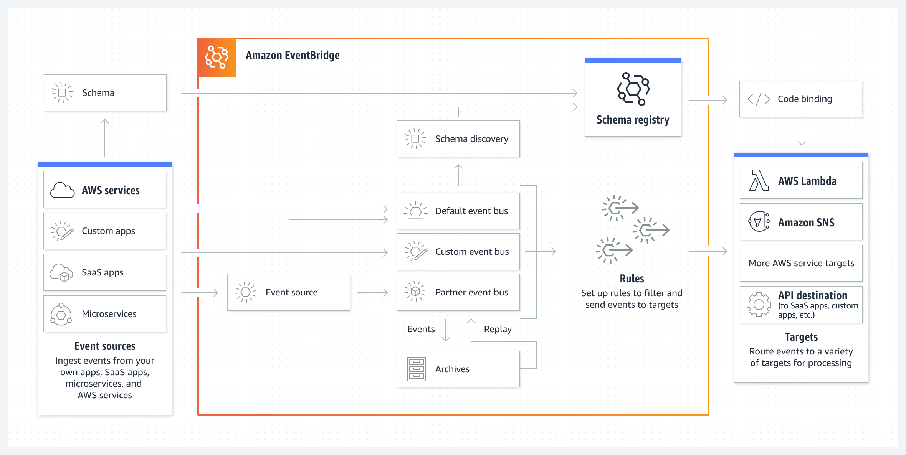

# Amazon EventBridge

EventBridge is a serverless event bus service that you can use to connect your applications with data from various sources. 

EventBridge delivers a stream of real-time data **from** your applications, software as a service applications, and AWS services **to** targets such as AWS Lambda functions, HTTP invocation endpoints using API destinations, or event buses in other AWS accounts.

EventBridge receives an event, which is an indicator of a change in environment. EventBridge then applies a rule to route the event to a 
target.

Rules match events to targets based on either the structure of the event (event pattern), or on a schedule.

> For example, when an EC2 instance changes from pending to running, you can have a rule that sends the event to a Lambda function.

## Event bus

All events that come to EventBridge are associated with an event bus.

Rules are tied to a single event bus, so they can only be applied to events on that event bus.

Your account has a default event bus, which receives events from AWS services. You can also create custom event buses to send or receive events from a different account or Region.

## Use cases

EventBridge is recommended for applications that react to events from SaaS applications or AWS services.

EventBridge is the only event-based service that integrates directly with third-party SaaS AWS Partners. EventBridge also automatically ingests events from over 90 AWS services without the need for developers to create additional resources.

EventBridge uses a defined, JSON-based structure for events.

EventBridge currently supports over 15 AWS services as targets, including AWS Lambda, Amazon SQS, Amazon SNS, Amazon Kinesis Data Streams, Amazon Kinesis Data Firehose, and more.

At launch, EventBridge has limited throughput, which can be increased on request. It also has a typical latency of about half a second.
