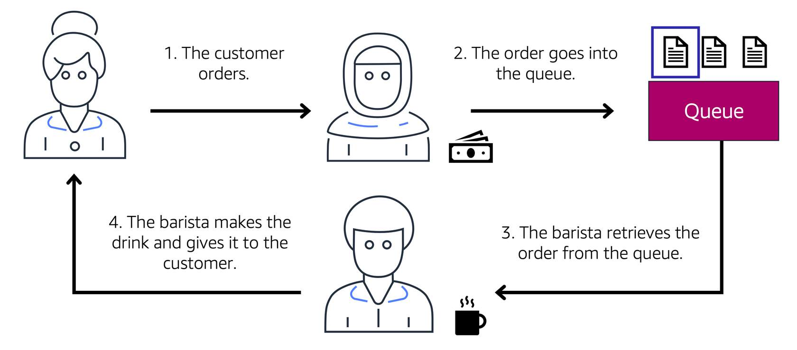

# Amazon Simple Queue Service (Amazon SQS)

Amazon SQS is a fully managed, message queuing service that you can use to decouple and scale microservices, distributed systems, and serverless applications.

Using Amazon SQS, you can send, store, and receive messages between software components, without losing messages or requiring other services to be available.

In Amazon SQS, an application sends messages into a queue. A user or service retrieves a message from the queue, processes it, and then deletes it from the queue.

When you create or edit a queue, you can configure the following parameters:

- **Visibility timeout**: The length of time that a message received from a queue (by one consumer) won't be visible to the other message consumers.
- **Message retention period**: The amount of time that Amazon SQS retains messages that remain in the queue. By default, the queue retains messages for 4 days. You can configure a queue to retain messages for up to 14 days.
- **Delivery delay**: The amount of time that Amazon SQS will delay before it delivers a message that is added to the queue.
- **Maximum message size**: The maximum message size for the queue.
- **Receive message wait time**: The maximum amount of time that Amazon SQS waits for messages to become available after the queue gets a receive request.
- **Enable content-based deduplication**: Amazon SQS can automatically create deduplication IDs based on the body of the message.
- **Enable high throughput FIFO**: This feature enables high throughput for messages in the queue. Choosing this option changes the related options (deduplication scope and FIFO throughput limit) to the required settings for enabling high throughput for FIFO queues.
- **Redrive allow policy**: This policy defines which source queues can use this queue as the dead-letter queue.

## Short polling compared to long polling

### Short polling

When you consume messages from a queue by using short polling, Amazon SQS samples a subset of its servers and returns messages from only those servers.

If you keep consuming from your queues, Amazon SQS samples all of its servers, and you receive all of your messages.

> The following diagram shows the short-polling behavior of messages returned from a standard queue after one of your system components makes a receive request. Amazon SQS returns messages A, C, D, and B from these servers. Message E isn't returned for this request, but it's returned for a subsequent request.

### Long polling

When the wait time for the ReceiveMessage API action is greater than 0, long polling is in effect (maximum 20 seconds).

Long polling helps reduce the cost of using Amazon SQS by reducing the number of empty responses and false empty responses.

Long polling offers the following benefits:

- Reduces empty responses by letting Amazon SQS wait until a message is available in a queue before it sends a response (In rare cases, you might receive empty responses even when a queue still contains messages, especially if you specify a low value for the ReceiveMessageWaitTimeSeconds parameter).
- Reduces false empty responses by querying all—instead of a subset of—Amazon SQS servers.
- Returns messages as soon as they become available.