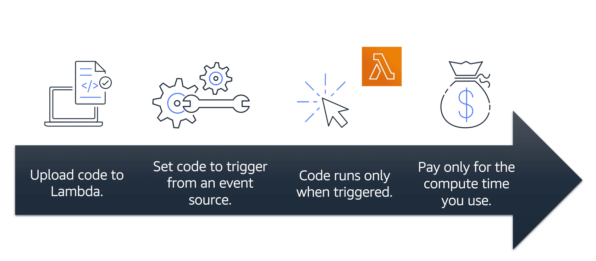

# Serverless and AWS Lambda

If you run your code on Amazon EC2, AWS is responsible for the physical hardware and you are responsible for the logical controls, such as guest operating system, security and patching, networking, security, and scaling.

If you run your code in containers on Amazon ECS and Amazon EKS, AWS is responsible for more of the container management, such as deploying containers across EC2 instances and managing the container cluster. However, when running ECS and EKS on EC2, you are still responsible for maintaining the underlying EC2 instances.

If you want to deploy your workloads and applications without having to manage any EC2 instances, you can do that on AWS with serverless compute.

Every definition of serverless mentions four aspects:

- No servers to provision or manage.
- Scales with usage.
- You never pay for idle resources.
- Availability and fault tolerance are built-in.

AWS has several serverless compute options, including AWS Fargate and AWS Lambda.

## Serverless Containers with AWS Fargate

Amazon ECS and Amazon EKS enable you to run your containers in two modes:

- Amazon EC2 mode
- AWS Fargate mode

AWS Fargate abstracts the EC2 instance so you're not required to manage it.

It natively integrates with AWS Identity and Access Management (IAM) and Amazon Virtual Private Cloud (VPC). 

Having native integration with Amazon VPC allows you to launch Fargate containers inside your network and control connectivity to your applications.

## Run Your Code on AWS Lambda

AWS Lambda is a service that lets you run code without provisioning or managing servers or containers.

AWS Lambda requires zero administration from the user. You upload your source code and Lambda takes care of everything required to run and scale your code with high availability.

### How Lambda Works

There are three primary components of a Lambda function: the trigger, code, and configuration.

The **code** is source code, that describes what the Lambda function should run.

When you create your Lambda function, you specify the **runtime** you want your code to run in. There are built-in runtimes such as Python, Node.js, Ruby, Go, Java, .NET Core, or you can implement your Lambda functions to run on a custom runtime.

The **configuration** of a Lambda function consists of information that describes how the function should run. In the configuration, you specify network placement, environment variables, memory, invocation type, permission sets, and other configurations.

**Triggers** describe when the Lambda function should run. A trigger integrates your Lambda function with other AWS services, enabling you to run your Lambda function in response to certain API calls that occur in your AWS account. 

1. You upload your code to Lambda. 
1. You set your code to trigger from an event source, such as AWS services, mobile applications, or HTTP endpoints.
1. Lambda runs your code only when triggered.
1. You pay only for the compute time that you use. 

### Billing Granularity

You pay only for the compute time that you consume. Charges apply only when your code is running, rounded up to the nearest 1ms (duration).

AWS rounds up duration to the nearest millisecond with no minimum execution time.

It can be very cost effective to run functions whose execution time is very low, such as functions with durations under 100ms or low latency APIs.