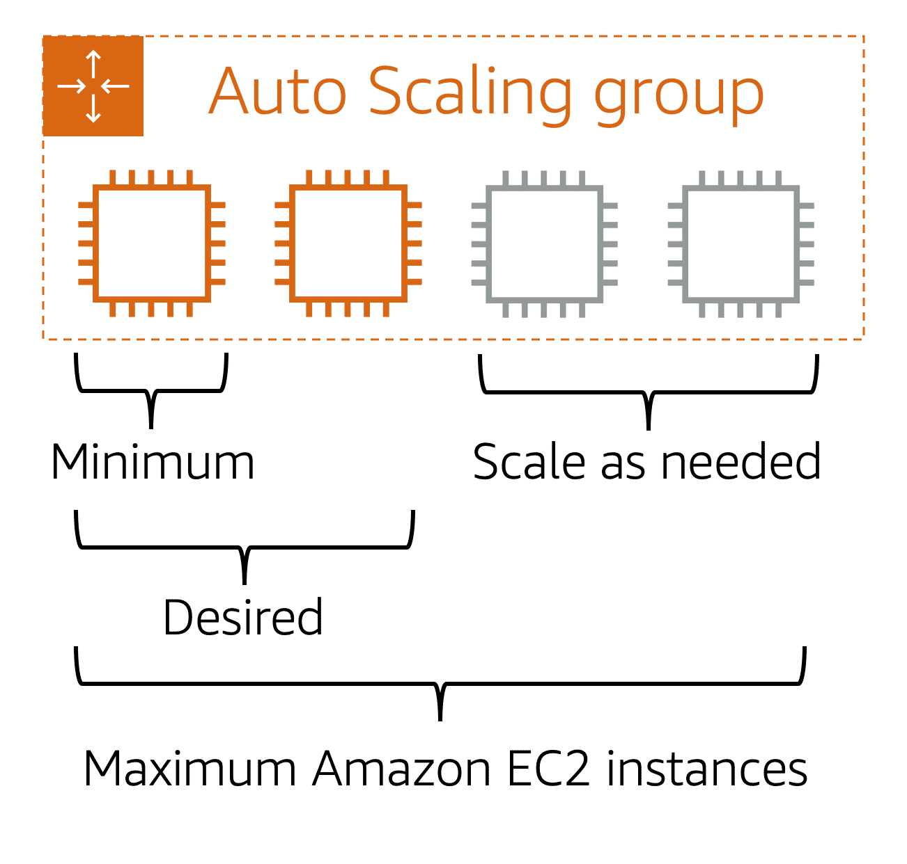

# Amazon EC2 Auto Scaling

## Scalability

Scalability involves beginning with only the resources you need and designing your architecture to automatically respond to changing demand by scaling out or in. As a result, you pay for only the resources you use.

## Intro

**Amazon EC2 Auto Scaling** enables you to automatically add or remove Amazon EC2 instances in response to changing application demand.

Within Amazon EC2 Auto Scaling, you can use two approaches:
- **Dynamic scaling** responds to changing demand. 
- **Predictive scaling** automatically schedules the right number of Amazon EC2 instances based on predicted demand.

**Example:**

When you create an Auto Scaling group, you can set the minimum number of Amazon EC2 instances. The **minimum capacity** is the number of Amazon EC2 instances that launch immediately after you have created the Auto Scaling group.

Next, you can set the **desired capacity** at two Amazon EC2 instances even though your application needs a minimum of a single Amazon EC2 instance to run.

The third configuration that you can set in an Auto Scaling group is the **maximum capacity**.

## Differentiate Between Traditional Scaling and Auto Scaling

With a **traditional approach** to scaling, you buy and provision enough servers to handle traffic at its peak. However, this means that at night time, there is more capacity than traffic. This also means you're wasting money. Turning off those servers at night or at times where the traffic is lower only saves on electricity. 

The EC2 Auto Scaling service works to add or remove capacity to keep a steady and predictable performance at the lowest possible cost. By adjusting the capacity to exactly what your application uses, you only pay for what your application needs. 

If there is an issue with an EC2 instance, EC2 Auto Scaling can automatically replace that instance. This means that EC2 Auto Scaling helps both to scale your infrastructure and ensure high availability. 

## EC2 Auto Scaling Components

### Launch Templates

The infomation required to create EC2 instances is stored in a launch template.

It also supports **versioning**, which allows for quickly rolling back if there was an issue.

You can create a launch template one of three ways. 

- use an existing EC2 instance.
- from an already existing template or a previous version of a launch template.
- create a template from scratch. The following options will need to be defined: AMI ID, instance type, key pair, security group, storage, and resource tags.

### Auto Scaling Groups

An ASG enables you to define where EC2 Auto Scaling deploys your resources: **VPC and subnets** the EC2 instance should be launched in.

There are three capacity settings to configure how many instances EC2 Auto Scaling should launch:

- **Minimum**: The minimum number of instances running in your ASG even if **the threshold for lowering the amount of instances** is reached.
- **Maximum**: The maximum number of instances running in your ASG even if **the threshold for adding new instances** is reached.
- **Desired capacity**: The amount of instances that should be in your ASG. This number can only be within or equal to the minimum or maximum. EC2 Auto Scaling automatically adds or removes instances to match the desired capacity number.

### Scaling Policies

#### Simple Scaling Policy

You use a CloudWatch alarm and specify what to do when it is triggered. This can be a number of EC2 instances to add or remove, or a specific number to set the desired capacity to.

Once this scaling policy is triggered, it waits a **cooldown period** before taking any other action. This is important as it takes time for the EC2 instances to start and the CloudWatch alarm may still be triggered while the EC2 instance is booting. 

#### Step Scaling Policy

Step scaling policies respond to additional alarms even while a scaling activity or health check replacement is in progress.

*For example, you decide to add two more instances in case the CPU utilization is at 85%, and four more instances when it's at 95%.*

[AWS: Step and simple scaling policies for Amazon EC2 Auto Scaling](https://docs.aws.amazon.com/autoscaling/ec2/userguide/as-scaling-simple-step.html)

#### Target Tracking Scaling Policy

If your application scales based on average CPU utilization, average network utilization (in or out), or based on request count, then this scaling policy type is the one to use. All you need to provide is the target value to track and it automatically creates the required CloudWatch alarms.

To create a target tracking scaling policy, you specify an Amazon CloudWatch metric and a target value that represents the ideal average utilization or throughput level for your application. Amazon EC2 Auto Scaling can then scale out your group (add more instances) to handle peak traffic, and scale in your group (run fewer instances) to reduce costs during periods of low utilization or throughput.

*For example, let's say that you currently have an application that runs on two instances, and you want the CPU utilization of the Auto Scaling group to stay at around 50 percent when the load on the application changes. This gives you extra capacity to handle traffic spikes without maintaining an excessive number of idle resources.*

## Elastic Load balancer and EC2 Auto Scaling

The ELB service integrates seamlessly with EC2 Auto Scaling. As soon as a new EC2 instance is added to or removed from the EC2 Auto Scaling group, ELB is notified.

However, before it can send traffic to a new EC2 instance, it needs to validate that the application running on that EC2 instance is available. This validation is done via the health checks feature of ELB.
