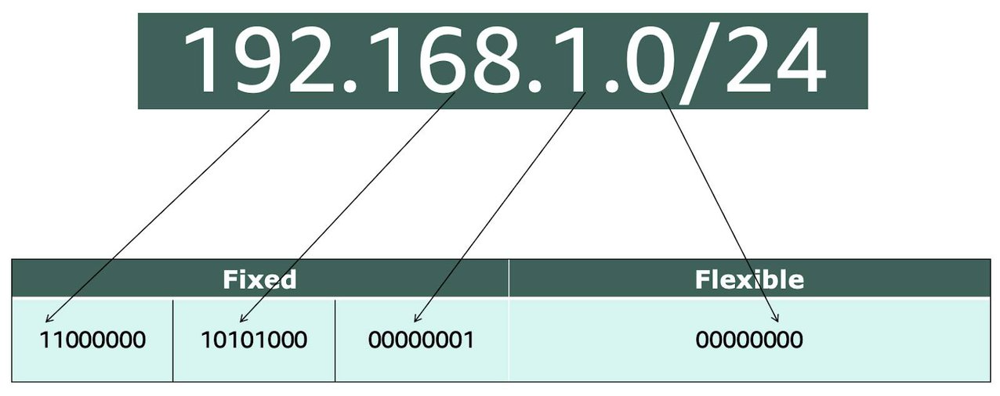

# Networking Basics

## IP Addresses?

In order to properly route your messages to a location, you need an address. Just like each home has a mail address, each computer has an IP address.

Here is an example of a 32-bit address in binary format: 

## CIDR Notation

`192.168.1.30` is a single IP address. If you wanted to express IP addresses between the range of `192.168.1.0` and `192.168.1.255`, how can you do that?

One way is by using Classless Inter-Domain Routing (CIDR) notation. CIDR notation is a compressed way of specifying a range of IP addresses. Specifying a range determines how many IP addresses are available to you. 

CIDR notation looks like this: 

It begins with a starting IP address and is separated by a forward slash (the "/” character) followed by a number. The number at the end specifies how many of the bits of the IP address are fixed. In this example, the first 24 bits of the IP address are fixed. The rest are flexible.

In AWS, the smallest IP range you can have is `/28`, which provides you **16** IP addresses. The largest IP range you can have is a `/16`, which provides you with **65,536** IP addresses.

- `10.0.0.0/16` -> 65,536 possible addresses (`10.0.0.0` - `10.0.255.255`)
- `10.0.0.0/28` -> 16 possible addresses (`10.0.0.0` - `10.0.0.15`)
