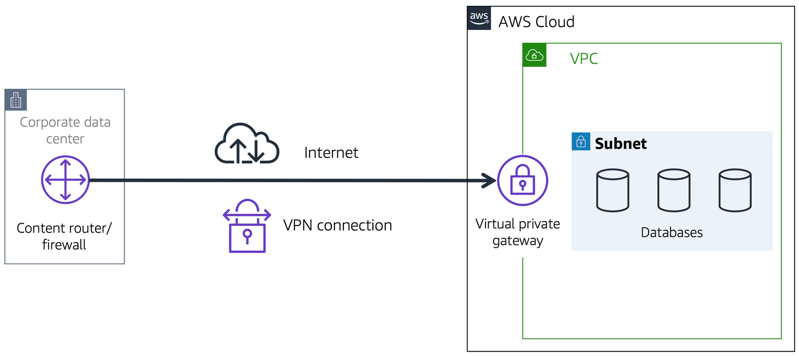

# Amazon VPC

## Amazon VPC

Amazon Virtual Private Cloud (Amazon VPC) is a networking service that you can use to establish network boundaries around your AWS resources.

A VPC is an isolated network you create in the AWS cloud, similar to a traditional network in a data center.

When you create a VPC, you need to choose three main things.

- The name of your VPC.
- A Region for your VPC to live in. Each VPC spans multiple Availability Zones within the Region you choose.
- A IP range for your VPC in CIDR notation.

## Subnet

A subnet is a section of a VPC that can contain resources (such as Amazon EC2 instances)

When you create a subnet, you need to choose three settings.

- The  VPC you want your subnet to live in, in this case VPC (`10.0.0.0/16`).
- The Availability  Zone you want your subnet to live in, in this case `AZ1`.
- A CIDR  block for your subnet, which must be a subset of the VPC CIDR block, in  this case `10.0.0.0/24`.

When you create your subnets, in order to maintain redundancy and fault tolerance, create at least two subnets configured in two different Availability Zones.

In this case, if one of these AZs fail, you still have your resources in another AZ available as backup.

Subnets can be public or private. 

**Public subnets** contain resources that need to be accessible by the public, such as an online store’s website.

**Private subnets** contain resources that should be accessible only through your private network, such as a database.

In a VPC, subnets can communicate with each other. For example, you might have an application run in an Amazon EC2 instance in a public subnet communicating with databases that are located in a private subnet.

## Reserved IPs

For AWS to configure your VPC appropriately, AWS reserves five IP addresses in each subnet. These IP addresses are used for routing, Domain Name System (DNS), and network management.

*For example, consider a VPC with the IP range `10.0.0.0/22`. The VPC includes 1,024 total IP addresses. This is divided into four equal-sized subnets, each with a `/24` IP range with 256 IP addresses. Out of each of those IP ranges, there are only 251 IP addresses that can be used because AWS reserves five.*

A common starting place for those who are new to the cloud is to create a VPC with a IP range of `/16` and create subnets with a IP range of `/24`. This provides a large amount of IP addresses to work with at both the VPC and subnet level.

## Internet Gateway

To allow public traffic from the internet to access your VPC, you attach an internet gateway to the VPC.

## Virtual Private Gateway

VGW works as a VPN connector on the AWS side that establishes a secure connection between your on-premises server and cloud-hosted VPC.

It can be attached to a single VPC or used as a transit hub to interconnect multiple VPCs and on-premises networks.

A virtual private gateway allows you to connect your AWS VPC to another private network.

> Once you create and attach a VGW to a VPC, the gateway acts as anchor on the AWS side of the connection. On the other side of the connection, you'll need to connect a customer gateway to the other private network.
>
> A customer gateway device is a physical device or software application on your side of the connection. Once you have both gateways, you can then establish an encrypted VPN connection between the two sides.

## AWS Direct Connect

AWS Direct Connect is a service that enables you to establish a dedicated private connection between your data center and a VPC.

The private connection that AWS Direct Connect provides helps you to reduce network costs and increase the amount of bandwidth that can travel through your network.

