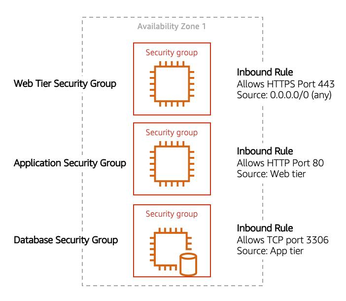

# Security

## Network Traffic in a VPC

When a customer requests data from an application hosted in the AWS Cloud, this request is sent over the internet.

It enters into a VPC through an internet gateway. Before a packet can enter into a subnet or exit from a subnet, it is checked for permissions by network access control list (ACL).

## Network ACLs (secure subnets)

A network access control list (ACL) is a virtual firewall that controls what kind of traffic is allowed to enter or leave your subnet.

For example, if you have a web application, you might restrict your network to allow HTTPS traffic and remote desktop protocol (RDP) traffic to your web servers.

**Inbound**:

| Rule # | Source IP | Protocol | Port | Allow/Deny | Comments |
|---|---|---|---|---|---|
| 100 | All  IPv4 traffic | TCP | 443 | ALLOW | Allows  inbound HTTPS traffic from anywhere |
| 130 | 192.0.2.0/24 | TCP | 3389 | ALLOW | Allows  inbound RDP traffic to the web servers from your home network's public IP  address range (over the internet gateway) |
| * | All  IPv4 traffic | All | All | DENY | Denies  all inbound traffic not already handled by a preceding rule (not modifiable) |

**Outbound**:

| Rule # | Destination IP | Protocol | Port | Allow/Deny | Comments |
|---|---|---|---|---|---|
| 120 | 0.0.0.0/0 | TCP | 1025-65535 | ALLOW | Allows  outbound responses to clients on the internet (serving people visiting the  web servers in the subnet) |
| * | 0.0.0.0/0 | All | All | DENY | Denies  all outbound traffic not already handled by a preceding rule (not modifiable) |

*Notice that in the network ACL example above, you allow inbound 443 and outbound range 1025-65535. That's because HTTP uses port 443 to initiate a connection and will respond to an ephemeral port.*

Network ACLs perform stateless packet filtering. They remember nothing and check packets that cross the subnet border each way: inbound and outbound.

If you don't include the outbound range, your server would respond but the traffic would never leave the subnet.

## Security Groups (Secure Your EC2 Instances)

A security group is a virtual firewall that controls inbound and outbound traffic for a particular entity, such as an EC2 instance.

The default configuration of a security group blocks all inbound traffic and allows all outbound traffic.

Security groups perform stateful packet filtering. They remember if a connection is originally initiated by the EC2 instance or from the outside and temporarily allow traffic to respond without having to modify the inbound rules. 

A common design pattern is organizing your resources into different groups and creating security groups for each to control network communication between them.

