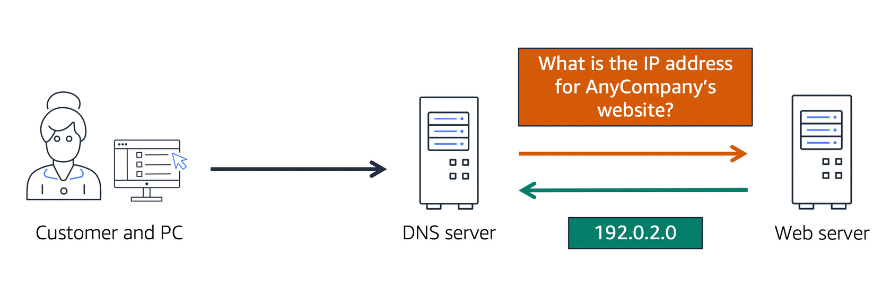

# Domain Name System (DNS)

DNS resolution is the process of translating a domain name to an IP address. 

## Amazon Route 53

Amazon Route 53 is a DNS web service.

It connects user requests to infrastructure running in AWS (such as Amazon EC2 instances and load balancers).

It can route users to infrastructure outside of AWS.

Another feature of Route 53 is the ability to manage the DNS records for domain names. You can register new domain names directly in Route 53. You can also transfer DNS records for existing domain names managed by other domain registrars.

## How Amazon Route 53 and Amazon CloudFront deliver content 

Suppose that AnyCompany’s application is running on several Amazon EC2 instances. These instances are in an Auto Scaling group that attaches to an Application Load Balancer. 

1. A customer requests data from the application by going to AnyCompany’s website. 
1. Amazon Route 53 uses DNS resolution to identify AnyCompany.com’s corresponding IP address, 192.0.2.0. This information is sent back to the customer. 
1. The customer’s request is sent to the nearest edge location through Amazon CloudFront. 
1. Amazon CloudFront connects to the Application Load Balancer, which sends the incoming packet to an Amazon EC2 instance.