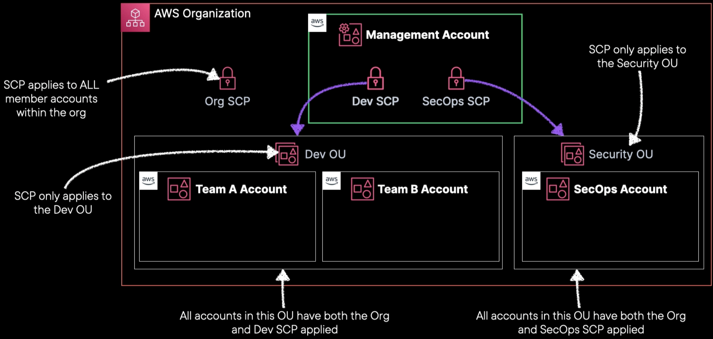

# AWS Organizations

AWS Organizations is a free governance tool that allows you to create and manage multiple AWS accounts.

With it, you can control your accounts from a single location rather than jumping from account to account.


## Account types

**Management Account**: Also called the Payer account, this is the primary account that hosts and manages the organization

**Member Account**: All other AWS accounts that belong to the organization. Can include development accounts, testing accounts, production accounts.


## Features

- **Consolidated Billing**: Rolls all bills up to the payer account. Single payment method
- **Usage Discounts**: Consolidated billing allows for aggregate usage discounts.
- **Shared Savings**: Easily share Reserved Instances and Savings Plans across the org. For example, you can share your central AWS Directory Service running on Managed Active Directory with all accounts in your organization, for application to access your central identity store.
- Automate AWS account creation and management
- Create groups of accounts to reflect business needs
- Govern access to AWS services resources in Region by policy


## Concepts

- Multi-account: Allows you to easily achieve a multi-account design while maintaining centralized management.
- Tag Enforcement: Capability to require specific tags is leveraged for all AWS resources. This ensures consistent tagging practices and it enables better resource categorization and tracking.
- Organizational Unit (OU): Logical grouping of multiple accounts to allow for easy management and separation.
- Service Control Policies (SCPs): JSON policies that get applied to OUs or accounts to restrict actions that are or are not allowed for different resources. They are the only way to restrict what the root account can do
- Management Account: SCPs do not affect the management account. The management account's' primary responsibility is for centralizing governance.


## Examples

We have an AWS organization with a management account and three team accounts in separate OUs. 

We apply an organization-wide service control policy to prevent root user access.

Then, we define specific service control policies for each OU, with different levels of control. These policies only apply to their respective group of accounts.

The development accounts have the development service control policy and the organizational policy, while the security operations account has the security policy and the organizational policy.

This allows for more granular control and simplifies the process.




## Service Control Policies

This is an example SCP in the form of a valid JSON document that denies any attempt to stop or terminate all EC2 instances within the account. It is similar to IAM policies.

```json
{
  "Version":"2012-10-17",
  "Statement":[
    {
      "Sid":"DenyStopAndTerminate",
      "Effect":"Deny",
      "Action":[
        "ec2:StopInstances",
        "ec2:TerminateInstances"
      ],
      "Resource":"*"
    }
  ]
}
```


## Best practices

- Create a centralized logging account for organizational CloudTrail logs.
- Leverage cross-account roles for accessing member accounts
- Plan ahead for the structure of your organization
- Keep the Master Account free of any operational AWS resources
- Apply least privilege practice
- Assign policies to organizational units rather than to accounts
- Test new and modified policies on a single account before scaling up to organizational units.
- Use the APIs and AWS CloudFormation templates to ensure that every newly graded account is configured to your liking