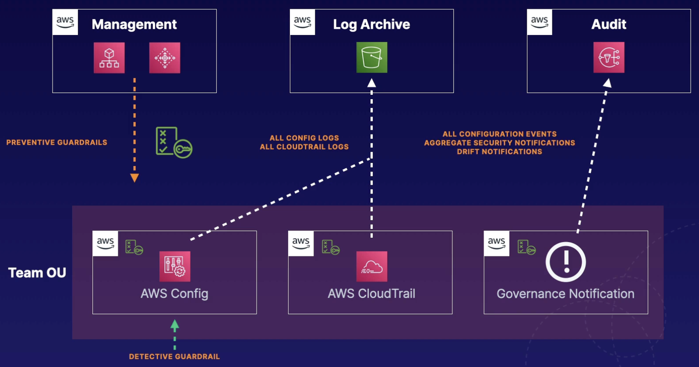

# AWS Control Tower

## Overview

AWS Control Tower offers you an easy way to set up and govern an AWS multi-account environment. It does this by offering an automated account deployment method
using preconfigured compliance rules.

It's essentially an orchestration service that automates account creation and security controls via other AWS services (AWS Organizations, AWS IAM Identity Center, AWS Config).

It's an extension or offers extensions to AWS Organizations to prevent governance drift, and leverages different guardrails.

It's the quickest way to create and manage a secure, compliant, multi-account environment.

Keywords and Scenarios: Automated multi-account governance, guardrails, account orchestration, and governed user account provisioning.

## Concepts

- Landing zone: Well-architected, multi-account environment based on compliance and security best practices
- Guardrails: High-level rules providing continuous governance for the AWS environment
- Account Factory: Configurable account template for standardizing pre-approved configs of new accounts
- CloudFormation StackSet: Automated deployments of templates deploying repeated resources for governance
- Shared accounts: Three accounts used by Control Tower created during landing zone creation: management account, log archive account, audit account.

### Guardrails

Guardrails have two different types:
- **Preventive**:
  - ensures accounts maintain governance by disallowing violating actions.
  - It does by leveraging service control policies.
  - Statuses include: **enforced**, **not enabled**.
  - Supported in all Regions.
- **Detective**:
  - Detects and alerts on noncompliant resources within all accounts
  - Leverages AWS Config rules
  - Statuses of **clear**, **in violation**, or **not enabled**
  - Only apply to certain Regions

## Example diagram

AWS Control Tower creates a log archive account and an audit account. These accounts, along with the management account, are considered shared accounts.

AWS Control Tower places preventative guardrails in each account by putting an SCP in every account that exists within the organizational unit. It also places AWS config rules or detective guardrails in each account.

After that, it sets up CloudTrail logging in all of these accounts, as well as notifications for any governance violations that may occur. All of the config and CloudTrail logs get aggregated and sent to the log archive account where you can view them and do whatever you need to do on the backend.

Any governance notifications that occur will be sent to an audit account, so this is configuration events, security notifications, or drift notifications. And they go to an SNS topic in the audit account which you can use to alert the correct team.

