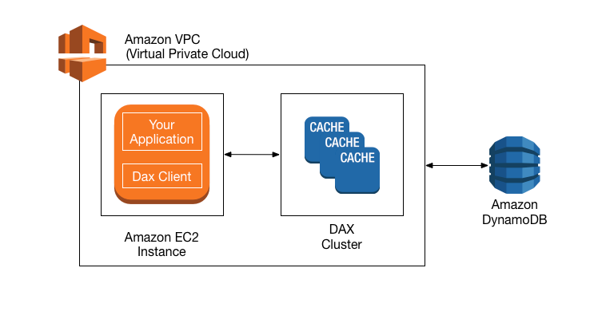

# Amazon DynamoDB

## What Is Amazon DynamoDB?

Amazon DynamoDB is a key-value database service.

Stored on SSD storage.

Spread across 3 geographically distinct data centers.

You get eventually consistent reads (default). You can opt in for strongly consistent reads.

**Serverless**: you do not have to provision, patch, manage servers, install, maintain, or operate software.. 

**Automatic Scaling**: As the size of your database shrinks or grows, DynamoDB automatically scales to adjust for changes in capacity while maintaining consistent performance. 

You can scale up or scale down tables' throughput capacity with minimal downtime or performance degradation.

## Read consistency

### Eventually consistent reads

Consistency across all copies of data is usually reached within a second.

Repeating a read after a short time should return the updated data. Best read performance.

### Strongly consistent reads

A strongly consistent read returns a result that reflects all writes that received a successful response prior to the read (you don't need to wait).

## Pricing

- Pay per request
- Balance cost & performance
- Pay more per request than with provisioned capacity
- Use for new products launches

## Security

- Encryption at rest using KMS.
- Can connect to DynamoDB using a Site-to-site VPN.
- Support Direct Connect (DX)
- Work with IAM policies & roles
- Integrate with CloudWatch, CloudTrail, VPC endpoints

## Backup & Restore

On-demand backup:
- DynamoDB has on-demand backup and restore.
- You can do full backups at any time. No impact on table performance or availability.
- You get consistent within seconds and retained until deleted.
- Operates within same region as the source table.

Point-in-time Recovery (PITR):
- You can restore to any point in the last 35 days. Latest restorable: 5 minutes in the past.
- It's done using incremental backups.
- not enabled by default.

## Core Components

A table is a collection of items.

Each table contains zero or more items.

An item is a group of attributes that is uniquely identifiable among all of the other items.

An attribute is a fundamental data element, something that does not need to be broken down any further. 

*For example, a table called People that you could use to store personal contact information about friends, family, or anyone else of interest. In a People table, each item represents a person. An item in a People table contains attributes called PersonID, LastName, FirstName, and so on.*

## DynamoDB Accelerator (DAX)

- Fully managed, highly available, in-memory cache
- 10× performance improvement than using just DynamoDB on its own.
- Reduces request time from milliseconds to microseconds - even under load
- No need for developers to manage caching logic. Application interact with DAX only.
- Compatible with DynamoDB API calls.
- Is not designed for applications that are write-intensive.
- Run within an Amazon VPC.

## DynamoDB Transactions

DynamoDB Transactions address ACID requirements.

DynamoDB transactions provide developers atomicity, consistency, isolation, and durability (ACID) across 1 or more tables within a single AWS account and region.

## DynamoDB Streams

DynamoDB Streams are time-ordered sequence of item-level changes in a table.

Every time your data changes (insert, update, delete), it comes with a sequence number. These squences are stored in DynamoDB Streams. They are stored for 24 hours.

The records are broken into shards to make it manageable.

You can combine with Lambda functions for functionality like stored procedures.

## Global Tables

Global Tables are managed multi-master, multi-region replication. 

It's a way to replicate your tables from one to another region. For disaster recovery or high availability.

Great for globally distributed applications.

Need to turn on on DynamoDB Streams to enable this.

Replication latency under 1 second.

Work transparently. No code rewrites.