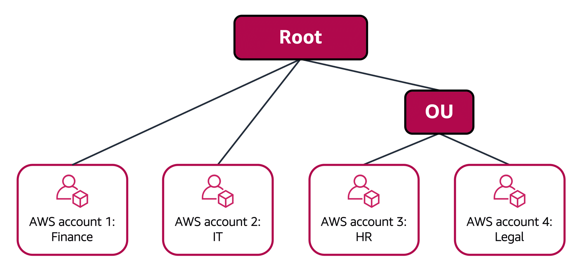

# AWS Organizations

Suppose that your company has multiple AWS accounts. You can use AWS Organizations to consolidate and manage multiple AWS accounts within a central location.

When you create an organization, AWS Organizations automatically creates a **root**, which is the parent container for all the accounts in your organization.

You can apply service control policies (SCPs) to the organization root, an individual member account, or an OU.

SCPs enable you to place restrictions on the AWS services, resources, and individual API actions that users and roles in each account can access.

## Organizational Units

In AWS Organizations, you can group accounts into organizational units (OUs) to make it easier to manage accounts with similar business or security requirements.

When you apply a policy to an OU, all the accounts in the OU automatically inherit the permissions specified in the policy.  

> For instance, if your company has accounts that can access only the AWS services that meet certain regulatory requirements, you can put these accounts into one OU. Then, you can attach a policy to the OU that blocks access to all other AWS services that do not meet the regulatory requirements.

> The finance and IT departments have requirements that do not overlap with those of any other department. You bring these accounts into your organization to take advantage of benefits such as consolidated billing, but you do not place them into any OUs.
>
> The HR and legal departments need to access the same AWS services and resources, so you place them into an OU together. Placing them into an OU enables you to attach policies that apply to both the HR and legal departments’ AWS accounts.
>
> Even though you have placed these accounts into OUs, you can continue to provide access for users, groups, and roles through IAM.

## Features

- Automate AWS account creation and management
- Create groups of accounts to reflect business needs
- Govern access to AWS services resources in Region by policy
- Set up a single payment method for all AWS accounts with consolidated billing
- Share resources across accounts. For example, you can share your central AWS Directory Service running on Managed Active Directory with all accounts in your organization, for application to access your central identity store.

## Best practices

- Plan ahead for the structure of your organization
- Keep the Master Account free of any operational AWS resources
- Use AWS CloudTrail in the master account to centrally track all AWS usage in the member accounts.
- Apply least privilege practice
- Assign policies to organizational units rather than to accounts
- Test new and modified policies on a single account before scaling up to organizational units.
- Use the APIs and AWS CloudFormation templates to ensure that every newly graded account is configured to your liking