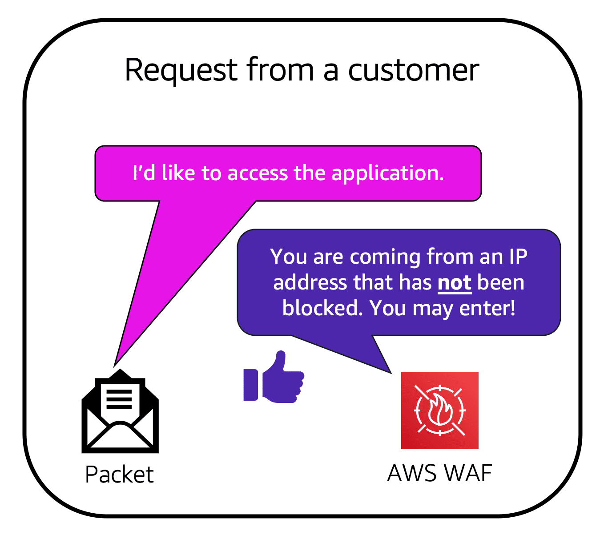

# AWS WAF

## Overview

AWS WAF is a web application firewall that lets you monitor HTTP/HTTPS requests that are forwarded to Amazon CloudFront or an Application Load Balancer. 

WAF can block:
- layer 7 DDoS attacks
- SQL injections
- cross-site scripting.
- access to specific countries or IP addresses

WAF also lets you control access to your content.

You can use AWS WAF to create custom rules that block common attack patterns (SQL injection, cross-site scripting) and application specific. It does this by using a [web access control list (ACL)](https://docs.aws.amazon.com/waf/latest/developerguide/web-acl.html) to protect your AWS resources. 

> You can configure conditions such as what IP addresses are allowed to make this request or what query string parameters need to be passed for the request to be allowed.
>
> The Application Load Balancer or CloudFront will either allow this content to be received or give an HTTP 403 status code.

## Behaviors

At its most basic level, it allows 3 different behaviors:

- Allow all requests except the ones you specify.
- Block all requests except the ones you specify.
- Count the requests that match the properties you specify.

You can define conditions by using characteristics of web requests such as the following:
- IP addresses that requests originate from
- Country that requests originate from
- Values in request headers
- Presence of SQL code that is likely to be malicious (known as SQL injection)
- Presence of a script that is likely to be malicious (known as cross-site scripting)
- Strings that appear in requests - either specific strings or strings that match regular expression (regex) patterns
