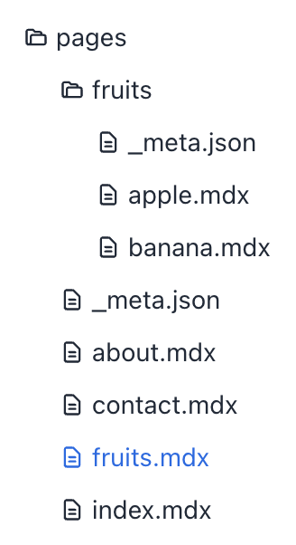

# Page Configuration

In Nextra, the site and page structure can be configured
 via the co-located `_meta.json` files.


## Folders with Index Page

If you want to have a folder with an index page, we can add a 
MDX page with the same name and in the same directory as the folder.

Let's say we want to add `/fruits` route in the example 
above, we can create a `fruits.mdx` file in pages:



Then Nextra knows that the `fruits` key in `_meta.json` defines 
a folder with an index page. If you click that folder in the 
sidebar, it will open the folder and show you the `fruits.mdx` 
page at the same time.


## External Links

You can add external links to the sidebar by adding an item
 with `href` in `_meta.json`:

```json filename="pages/_meta.json" {6-9}
{
  "github_link": {
    "title": "Nextra",
    "href": "https://github.com/shuding/nextra"
  }
}
```

To always open the link in a new tab, enable the 
`"newWindow": true` option:

```json filename="pages/_meta.json" {9}
{
  "github_link": {
    "title": "Nextra",
    "href": "https://github.com/shuding/nextra",
    "newWindow": true
  }
}
```

## Hidden Routes

By default, all MDX routes in the filesystem will be shown on 
the sidebar. But you can hide a specific pages or folders by
 using the `"display": "hidden"` configuration:

```json filename="pages/_meta.json" {4}
{
  "index": "My Homepage",
  "contact": {
    "display": "hidden"
  },
  "about": "About Us"
}
```

The page will still be accessible via the `/contact` URL, but 
it will not be shown in the sidebar.

## Navbar Items

### Sub Docs

By defining a top-level page or folder as `"type": "page"`, it
 will be shown as a special page on the navigation bar, instead 
 of the sidebar.

 In your top-level `_meta.json` file, you can set everything as 
 a page, instead of a normal sidebar item:

```json filename="pages/_meta.json"
{
  "index": {
    "title": "Home",
    "type": "page"
  },
  "frameworks": {
    "title": "Frameworks",
    "type": "page"
  },
  "fruits": {
    "title": "Fruits",
    "type": "page"
  },
  "about": {
    "title": "About",
    "type": "page"
  }
}
```

You can also hide links like `Home` from the navbar with the
`"display": "hidden"` option.

### Menus

You can also add menus to the navbar using `"type": "menu"` and the `"items"`
option:


```json filename="pages/_meta.json"
{
  "company": {
    "title": "Company",
    "type": "menu",
    "items": {
      "about": {
        "title": "About",
        "href": "/about"
      },
      "contact": {
        "title": "Contact Us",
        "href": "mailto:hi@example.com"
      }
    }
  }
}
```

### Links

You can have external links in the navbar too:

```json filename="pages/_meta.json"
{
  "index": {
    "title": "Home",
    "type": "page"
  },
  "about": {
    "title": "About",
    "type": "page"
  },
  "contact": {
    "title": "Contact Us",
    "type": "page",
    "href": "https://example.com/contact",
    "newWindow": true
  }
}
```

### Fallbacks

In the Sub Docs example above, we have to define the 
`"type": "page"` option for every page. To make it easier, 
you can use the `"*"` key to define the fallback configuration
 for all items in this folder:

```json filename="pages/_meta.json" {2-4}
{
  "*": {
    "type": "page"
  },
  "index": "Home",
  "frameworks": "Frameworks",
  "fruits": "Fruits",
  "about": "About"
}
```

They are equivalent where all items have `"type": "page"` set.


## Separators

You can use a "placeholder" item with `"type": "separator"` to create a
separator line between items in the sidebar:

```json filename="_meta.json"
{
  "index": "My Homepage",
  "---": {
    "type": "separator"
  },
  "contact": "Contact Us"
}
```

## Theme Components

You can configure the components for each page using the
 `"theme"` option.

For example, you can disable or enable specific components for 
specific pages:

```json filename="pages/_meta.json"
{
  "index": {
    "title": "Home",
    "theme": {
      "breadcrumb": false,
      "footer": true,
      "sidebar": false,
      "toc": true,
      "pagination": false
    }
  }
}
```

This option will be inherited by all child pages if set to a folder.


## Layouts

By default, each page has `"layout": "default"` in their theme config, which is the default behavior.

### Raw Layout

You can use the `"raw"` layout to let Nextra to not inject any
 styles to the content:

```json filename="pages/_meta.json" {5}
{
  "index": {
    "title": "Home",
    "theme": {
      "layout": "raw"
    }
  }
}
```

### Full Layout

You might want to render some page with the full container width and height, but
keep all the other styles. You can use the `"full"` layout to do that:

```json filename="pages/_meta.json" {5}
{
  "index": {
    "title": "Home",
    "theme": {
      "layout": "full"
    }
  }
}
```


## Typesetting (content style)

You can use the `"article"` typesetting to make content look
 like an elegant article page:

```json filename="pages/_meta.json" {5}
{
  "about": {
    "title": "About Us",
    "theme": {
      "typesetting": "article"
    }
  }
}
```