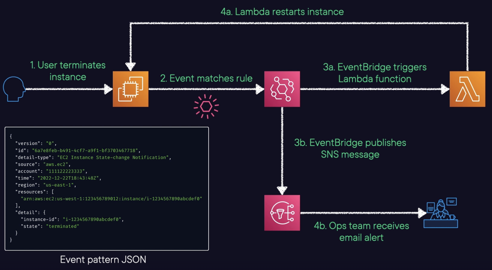

# Amazon EventBridge

## Overview

EventBridge is a serverless event bus service (formerly CloudWatch Events) that you can use to connect your applications with data from various sources. 

It allows you to pass events from a source to an endpoint. It's a glue that holds your serverless application together.

It's the fastest way to respond to things happening in your environment. At launch, EventBridge has limited throughput, which can be increased on request. It also has a typical latency of about half a second.

EventBridge is the only event-based service that integrates directly with third-party SaaS AWS Partners.

EventBridge also automatically ingests events **from** over 90 AWS services without the need for developers to create additional resources.

EventBridge currently supports over 15 AWS services as **targets**, including AWS Lambda, Amazon SQS, Amazon SNS, Amazon Kinesis Data Streams, Amazon Kinesis Data Firehose, ...

## Concepts

- **Events**: A recorded change in an AWS environment, SaaS partner, or one of your own configured applications/services. This also includes scheduled events.
- **Rules**: Criteria used to match incoming events and send them to the appropriate targets. Based on either event patterns or schedules.
- **Event Bus**: A router that receives events and delivers them to targets (destinations). Every account has a default bus, and you can create other custom buses for cross-account access.

## Rule Triggers

In EventBridge, you can set up rules to trigger actions
or workflows based on two primary types of rule triggers.

### Event Pattern

Define an event source and event pattern that will trigger your rule.

Example: a trigger via an EC2 termination event. When the specified event pattern matches incoming events, the rule gets triggered. And then with that, any associated actions get executed.

### Scheduled

Set up a recurring schedule for triggering your rule.

There're two types of scheduled rules:
- Rate-based: trigger at a fixed rate. Define using rate expression: `rate(1 hour)`
- Cron-based: You can specify precise dates, times,
and intervals for your rule triggers using cron expression. `cron(0 12 * * ? *)`

## Example architecture

We have a simple EC2 hosting some type
of application or service.

We've configured an EventBridge rule that looks for events
matching this termination event (the JSON event pattern look like below).

We can set up this rule
to trigger a Lambda function as well as send a message
to an SNS topic containing specific information
from this event.

We can leverage that function
to go ahead and get invoked by our rule
and maybe either restart the instance
or create a brand new one using this same AMI.

For SNS, we can go ahead
and send our operations team an alert via an email
that contains the details necessary for them
to go ahead and investigate.

## Use cases

EventBridge is recommended for applications that react to events from SaaS applications or AWS services.

Common use case is triggering Lambda functions when an AWS API call happens.
