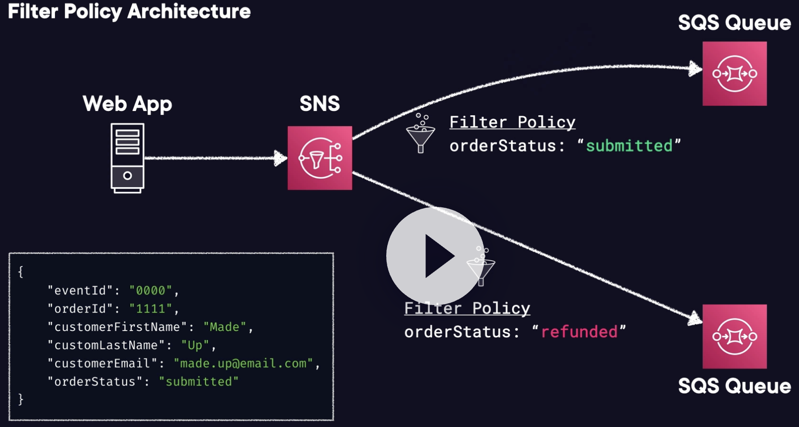

# Amazon Simple Notification Service (Amazon SNS)

## Overview

SNS is a push-based messaging service (any messages sent by a producer and arrives at a SNS Topic will immediately be sent to all consumers).

It proactively delivers messages to the endpoints that are subcribed to it.

One message to many receivers.

## Use cases

Can be used to **alert** a system or a person.

Recommended for applications that need to react to high throughput or low-latency messages.

Amazon SNS offers nearly unlimited throughput, making it ideal for scenarios with high message volumes.

It can be used for applications requiring high fan-out, which means sending messages to thousands or millions of endpoints.

## Features

- **Subscribers**. They can be: Kinesis Data Firehose, SQS, Lambda, email, HTTP(s), mobile push notifications, SMS.
- **Message size**. Can be up to 256 KB.
- **DLQ Support**. Messages that fail to delivered can be stored in an SQS DLQ.
- **Support FIFO or Standard**. FIFO only support SQS FIFO queues as a subscriber.
- **Encryption**. Messages are encrypted in transit by default, you can add at-rest via AWS KMS.
- **Access Policies**. define who can publish/subcribe to a topic, useful for cross account access.
- **SNS Fanout**: Messages published to SNS topic are replicated to multiple endpoint subscriptions. Allow for fully decoupled parallel asynchronous processing!
- **Large Message Payloads**: It's a SNS Extended Library allows for sending messages up to 2 GB in size. The payload is stored in Amazon S3, then SNS publishes a reference to the object.
- **Message Filtering**: allow defining JSON policies to define which messages get sent to specific subscribers based on contents and attributes of messages.

Amazon SNS defines a delivery policy for each delivery protocol. The delivery policy defines how Amazon SNS retries the delivery of messages when server-side errors occur.

You can use a delivery policy and its four phases to define how Amazon SNS retries the delivery of messages to HTTP/S endpoints. With the exception of HTTP/S, you can't change Amazon SNS-defined delivery policies. **Only HTTP/S supports custom policies**.

## Architectures for SNS Fanout

