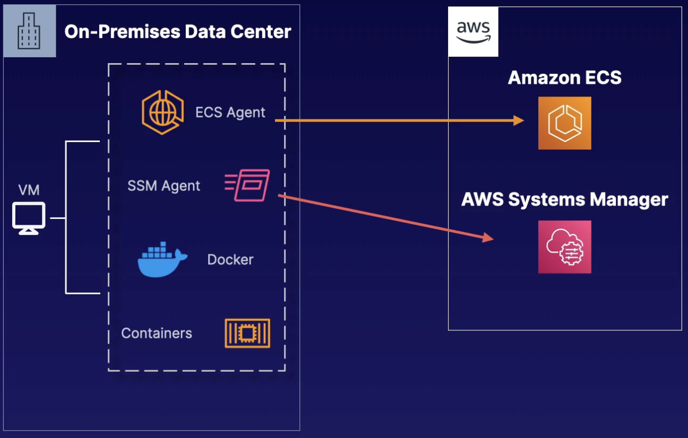

# Amazon ECS Anywhere

## Overview

It's a feature of ECS, enable you to run
and manage your container applications on-premises,
including your own VMs and even bare-metal servers.

No need to install and operate local container orchestration software, meaning more operational efficiency.

It offers completely managed solution enabling standardization of container management across environments. You're leveraging ECS standards and practices
and protocols **on-premises**.

Keep in mind, no ELB support for inbound traffic, that has to be handled separately.

It's known as the **EXTERNAL** launch type for creating your services or running tasks on your external instances.

## Requirements

- You must have the SSM Agent, ECS agent, and Docker installed
- You must first register external instances as SSM Managed Instances. You can do this easily by creating an installation script within the ECS console
- You run these scripts on your external instances and servers. The scripts contain SSM activation keys and commands for installing required software above.
- After all, you deploy containers using the EXTERNAL launch type. You can manage ECS cluster within the console, but all the hardware is running on-premises.'

## Example architecture

We have on-premises data center with our VM, where we run ECS cluster.

First we install all of the agents: ECS Agent, SSM Agent, Docker. We configure those agents to communicate with our AWS accounts.

The ECS agent talk to Amazon ECS in our account, it' keeps track of what version you're on, your cluster status, etc.,

The SSM Agent is communicating with Systems Manager, which allows you to run your scripts and see them as managed instances within the console.

