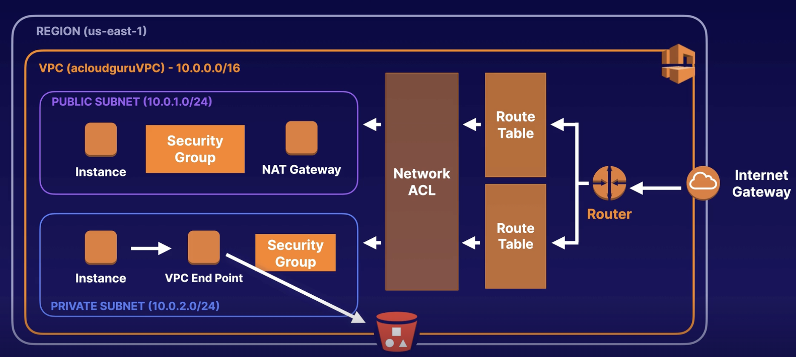

# Connect your VPC

## Internet Gateway

To allow public traffic from the internet to access your VPC, you attach an internet gateway to the VPC.

## NAT Gateways

You can use a network address translation (NAT) gateway to enable instances in a private subnet to connect to the internet (or AWS services) but external services **cannot initiate a connection** with those instances..

A NAT gateway is a VPC component that run inside a subnet.

It's scalable, starts at 5 Gbps to 45 Gbps.

It automatically is assigned an public IP address when created.

NAT gateways are not associated with security groups.

To achieve high availability, create a NAT Gateway in each AZ and configure your routing to ensure resources use the NAT gateway in the same AZ.

To enable internet access for instances in private subnets:
- Create a NAT Gateway in the public subnet.
- In the route table of the private subnet, add a route to direct network traffic to the NAT gateway.

## VPC Endpoints

You use VPC Endpoints when you want to **connect your VPC to AWS services without leaving the Amazon internal network**.

They are horizontally scaled, redundant, and highly available VPC components that **allow communication between instances in your VPC and services** without imposing availability risks or bandwidth constraints on your network traffic.

Instances in your VPC do not require public IP addresses to communicate with resources in the service.

There're two types of VPC Endpoints:
- **Interface endpoint**: is an elastic network interface with a private IP address, serves as an entry point for traffic headed to another AWS services. Support a large number of AWS services.
- **Gateway endpoints**: similar to NAT gateways, is a virtual device you provision. Support S3 and DynamoDB
