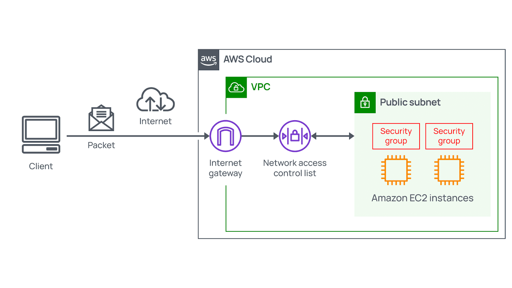

# Security

## Trafic flow in a VPC

**Internet Gateway** > **Router** > **Route Table** > **Network ACL** > **Subnet** > **Security Group** > **Instance**.

## Network ACLs (secure subnets)

Network ACLs are the first line of defense. Internet packet enters into a VPC through an internet gateway. Before a packet can enter into a subnet or exit from a subnet, it is checked for permissions by network access control list (ACL).

A network access control list (ACL) is a virtual firewall that controls trafic in and out of subnet.

The **default Network ACLs** allows all outbound and inbound traffic. **Custom network ACLs** deny all inbound and outbound traffic.

You can block IP addresses using network ACLs, not security groups.

You can associate a network ACL with multiple subnets; however, **a subnet can be associated with only 1 network ACL** at a time. When you associate a network ACL with a subnet, the previous association is removed.

Network ACLs contain a numbered list of rules that are **evaluated in order**, starting with the **lowest** numbered rule.

Network ACLs have separate **inbound and outbound rules**, and each rule can either allow or deny traffic.

**Network ACLs are stateless**; responses to allowed inbound traffic are subject to the rules for outbound traffic (and vice versa). If you don't include the outbound range, your server would respond but the traffic would never leave the subnet.

**Inbound**:

| Rule # | Source IP | Protocol | Port | Allow/Deny | Comments |
|---|---|---|---|---|---|
| 100 | All  IPv4 traffic | TCP | 443 | ALLOW | Allows  inbound HTTPS traffic from anywhere |
| 130 | 192.0.2.0/24 | TCP | 3389 | ALLOW | Allows  inbound RDP traffic to the web servers from your home network's public IP  address range (over the internet gateway) |
| * | All  IPv4 traffic | All | All | DENY | Denies  all inbound traffic not already handled by a preceding rule (not modifiable) |

**Outbound**:

| Rule # | Destination IP | Protocol | Port | Allow/Deny | Comments |
|---|---|---|---|---|---|
| 120 | 0.0.0.0/0 | TCP | 1025-65535 | ALLOW | Allows  outbound responses to clients on the internet (serving people visiting the  web servers in the subnet) |
| * | 0.0.0.0/0 | All | All | DENY | Denies  all outbound traffic not already handled by a preceding rule (not modifiable) |

*Notice that in the network ACL example above, you allow inbound 443 and outbound range 1025-65535. That's because HTTP uses port 443 to initiate a connection and will respond to an ephemeral port.*

## Security Groups (secure instances)

Security group are virtual firewalls for a particular entity, such as an EC2 instance.

By default, all inbound traffic are blocked, all outbound traffic are allowed.

Security groups are the last line of defense.

To allow everything, use `0.0.0.0/0`.

Security groups are stateful: if you send a request from your instance, the response traffic for that request is allowed to flow in regardless of inbound security group rules.

Responses to allowed inbound traffic are allowed to flow out, regardless of outbound rules.

### Security group pattern

A common design pattern is organizing your resources into different groups and creating security groups for each to control network communication between them.

