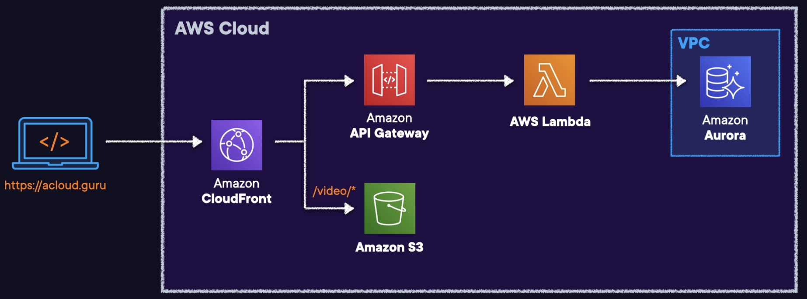

# Amazon API Gateway

Amazon API Gateway is a fully managed service that allows you to easily publish, create, maintain, monitor, and secure your API.

It allows you to put a safe "front door" on your application. Any scenarios involving accessing backend services privately, think of API Gateway.

Integrates with Lambda functions, HTTP endpoints, and other AWS services.

Support versioning of your API.

There're 3 types of options for us when creating an API using API Gateway.

- **REST API**: allow you to create and leverage things like API keys, per-client throttles, requests validation, Web application firewall (WAF) integration.
- **HTTP API**: simpler option than REST API, cheaper, minimal features.
- **WebSocket API**: collection of WebSocket routes, integrated with Lambda functions, HTTP endpoints, other AWS services.

There are no minimum fees or startup costs associated with API Gateway.

## Features

- **Security**: This service allows you to easily protect your endpoints by attaching a web application firewall (WAF).
- **Stop Abuse**: Users can easily implement DDoS protection and rate limiting to curb abuse of their endpoints.
- **Ease of Use**: API Gateway is simple to get started with. Easily build out the calls that will kick off other AWS services in your account.

## Endpoint types

- **Edge-Optimized**: Default option. API requests get sent through a CloudFront edge location. Best for global users.
- **Regional**: Perfect for clients that reside in the same, specific region.
Ability to also leverage with CloudFront if required.
- **Private**: Only accessible via VPCs using interface VPC endpoints.

## Securing your API

- API Gateway allows you to enforce user authentication at the API level.
- Authentication methods include IAM roles, STS credentials, long-term access keys to generate crednetials, Amazon Cognito pools, and custom authorizers using Lambda functions.
- AWS ACM can be used to implement custom TLS, and the certificate must be deployed to `us-east-1` for edge-optimized endpoints. Regional endpoints require ACM certs in the same region.
- **WAF** can be used to protect against DDoS and layer seven attacks when placed in front of your API.

## Architecture Diagram

Here's an architecture diagram for the ACG platform that uses serverless technology.

The public domain name is hit and the request is sent to AWS infrastructure via Route 53. 

The CloudFront distribution leverages different backend services such as API Gateway and Amazon S3 for specific path patterns.

API Gateway is deployed and published to many different AWS Lambda functions that perform various functions including reaching into an Amazon Aurora database.

This allows for API Gateway to front internal private services and interact with those services that live within things like a VPC and a private subnet.

