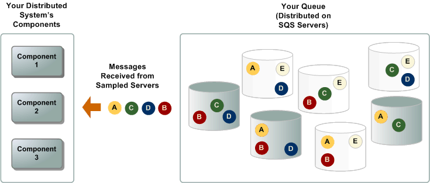

# Receiving messages

## Overview

When requesting messages, you determine the maximum number of messages you wish to retrieve, up to a limit of 10.

Messages are not automatically deleted after retrieval. You must explicitly send a delete request after processing the message to confirm successful receipt and handling.

Polling is a way to retrieve messages from SQS queues.

## Short polling

You send a request and the response returns immediately (even if the message queue is empty).

It queries only a subset of the available servers for messages (based on weighted random execution).

`ReceiveMessageWaitTime` is set to 0.

More requests are used, which implies higher cost.

Short polling is the default behavior.

> The following diagram shows the short-polling behavior of messages returned from a standard queue after one of your system components makes a receive request. Amazon SQS returns messages A, C, D, and B from these servers. Message E isn't returned for this request, but it's returned for a subsequent request.

## Long polling

When retrieving messages, empty response is occasionally returned. To optimize message retrieval and minimize empty responses, consider using long polling.

Long polling delays the response until a message becomes available or the poll times out.

Long polling reduces unnecessary polling costs and improving efficiency.

Can be enabled at the queue level or at the API level using `WaitTimeSeconds`.

Long polling takes effect when `ReceiveMessageWaitTime` is greater than 0, up to 20 seconds.

Shouldn't be used if your application expects an immediate response to receive message calls.

In rare cases, you might receive empty responses even when a queue still contains messages, especially if you specify a low value for the `ReceiveMessageWaitTime` parameter.

Same charge (per million requests) as short polling.
