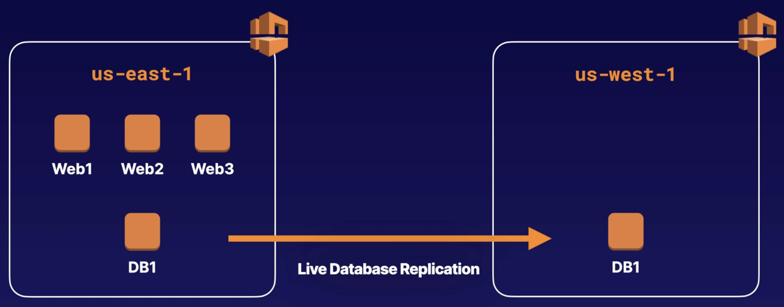
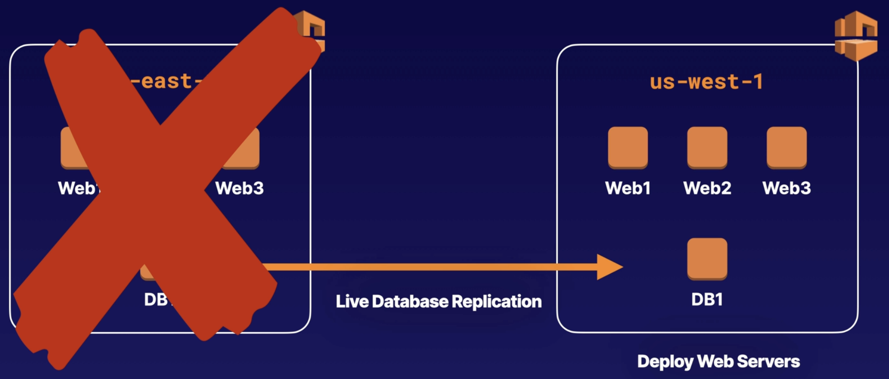
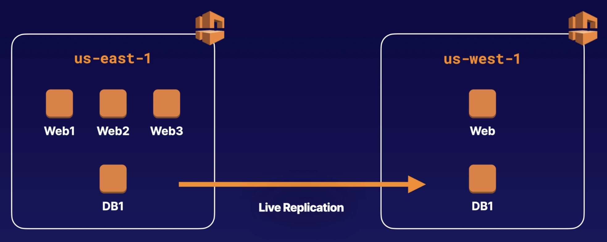
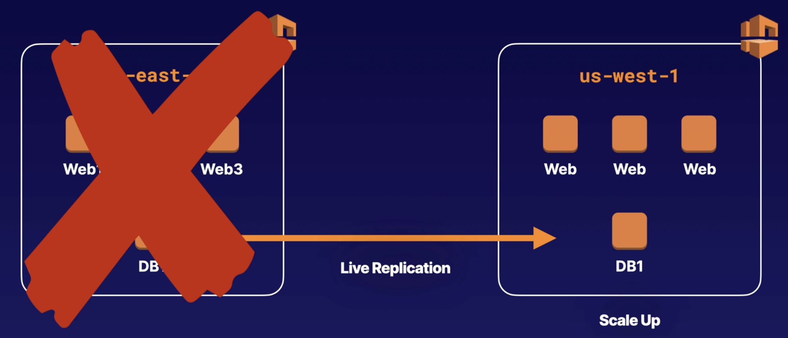
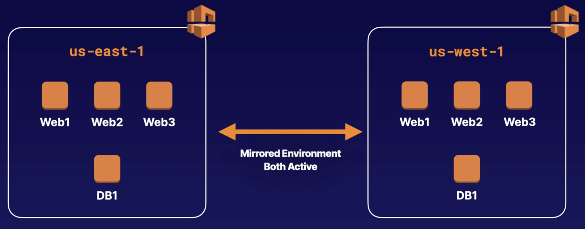
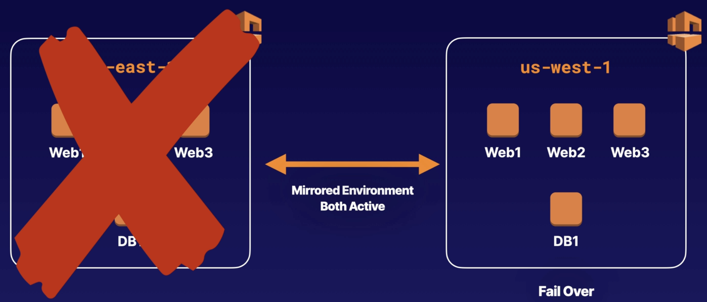

# Disaster Recovery Strategies

## Recovery Point Objective

The recovery point objective (RPO) is the maximum period of acceptable data loss (data loss tolerance).

*For instance, if an organization has an RPO of 60 minutes, it means they need to back up their system every 60 minutes.*

The lower the time, the greater the cost to achieve that.

## Recovery Time Objective

The recovery time objective (RTO) is the** maximum acceptable time to recover** data and resume processing after a failure.

RTO deals with how quickly an organization can resume business processes after a disaster.

## Backup and Restore

Cheapest, slowest option.

The simplest disaster recovery strategy. If something happens to your production system, restore that system from backup.

> If an EC2 instance goes offline, we can restore it from a snapshot.

## Pilot light

Faster than backup and restore, but some downtime.

A pilot light in a home hot water system is where a small light burns so that when you want to turn the hot water system on, it starts straight away. When a pilot light is burning, it is not consuming the same level of gas as when the system is on.

This is how it work in EC2:
- We have a VPC, three web servers, and one database server in one region.
- The database server has a live database replication in another region, with no web servers.
- It's similar to a pilot light. If a region is lost, web servers can be provisioned in front of the replicated database server to restore the system.

## Warm Standby

Quicker recovery time than pilot light, but sightly more expensive.

Where you have a scaled-down version of your production system already running in another Availability Zone/Region. You then scale this system up in the event of an outage.

It's similar to the pilot light with a bit more scaled up.

> We have three web servers and a database server in the `us-east-1` region with live replication to a database server in `us-west-1` region along with a web server as a standby.
>
> In case of losing the `us-east-1` region, the system can still function by scaling up and adding more web servers in `us-west-1` to handle the traffic.

## Active/Active Failover

Most expensive option, no downtime, lowest RTO and RPO.

You have two sites, both active and traffic split between the two. If one site fails, the other site takes the load. Generally, you have to have
both sites at 200% normal capacity to avoid downtime.

