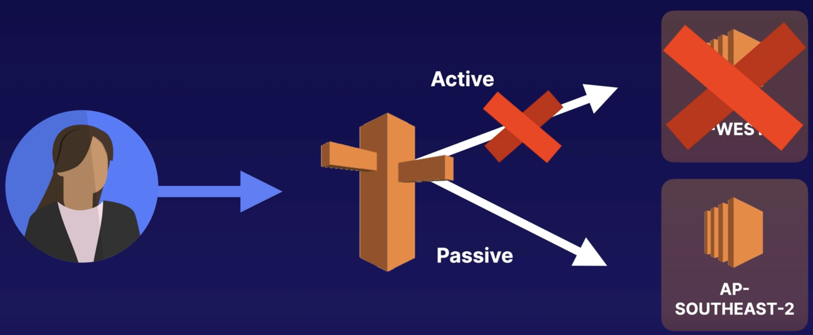
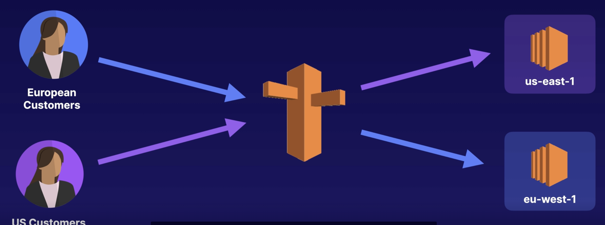

# Amazon Route 53

## Overview

Route 53 is Amazon's DNS service.

It allows you to register domain names, create hosted zones, and manage and create DIS records.

Route 53 is named after Route 66 (one of the original highways across the United States) but is called 53 because DNS operates on port 53.

Route 53 supports IPv4 and IPv6.

## Route 53 Traffic Flow

You can use Route 53 traffic flow to build a routing system that uses a combination of:
- geographic location
- latency
- and availability to route traffic
from your users to your cloud or on-premises endpoints.

It's a way of doing very highly complex routing of your DNS traffic, you built it out using a GUI.

You can build your traffic routing policies:
- from scratch
- or you can pick a template from a library and then customize it.

## Simple Routing Policy

When you create a record, if you choose the simple routing policy, you can only have one record with multiple IP addresses.

If you specify multiple values in a record, Route 53 returns all values to the user in a random order.

## Weighted Routing Policy

Allows you to split your traffic based on different weights assigned.

> For example, you can set 10% of your traffic to go to `us-east-1` and 90% to go to `eu-west-1`.

## Health Checks

You can set health checks on individual record sets.

If a record set fails a health check, it will be removed from Route 53 until it passes the health check.

You can set SNS notifications to alert vou about failed health checks.

## Failover Routing Policy

Failover routing policies are used when you want to create an active/passive set up.

> For example, you may want your primary site to be in EU-WEST-2 and your secondary disaster recovery Site in AP-SOUTHEAST-2.

Route53 will monitor the health of your primary site using a health check.

> In this example Route53 will send the traffic to AP-SOUTHEAST-2
because it has detected a failure in EU-WEST-2

## Geolocation Routing Policy

Geolocation routing lets you choose where your traffic will be sent based on the geographic location of your users (i.e., the location from which DNS queries originate).

> For example, you might want all queries from Europe to be routed to a fleet of C2 instances that are specifically configured for your European customers.
>
> These servers may have the local language of your European customers and display all prices in euros.

## Geoproximity Routing

Only available when built with Traffic Flow.

Geoproximity routing lets Amazon Route 53 route traffic to your resources based on the geographic location of your users and your resources.

You can also optionally choose to route more traffic or less to a given resource by specifying a value, known as a bias. A bias expands or shrinks the size of the geographic region from which traffic is routed to a resource.

## Latency Routing Policy

Allows you to route your traffic based on the lowest network latency for your end user (i.e., which region will give them the fastest response time).

To use latency-based routing, you create a **latency resource record set** for the EC2 (or ELB) resource in each region that hosts your website.

When Route 53 receives a query for your site, it selects the latency resource record set for the region that gives the user the lowest latency.

## Multivalue Answer Routing

Multivalue answer routing lets you configure Amazon Route 53 to return multiple values in response to DNS queries.

You can specify multiple values for almost any record.

Route 53 returns only values for healthy resources.

This is similar to simple routing; however, it allows you to put health checks on each record set.

## How Amazon Route 53 and Amazon CloudFront deliver content 

Suppose that AnyCompany's application is running on several Amazon EC2 instances. These instances are in an Auto Scaling group that attaches to an Application Load Balancer. 

1. A customer requests data from the application by going to AnyCompany's website. 
1. Amazon Route 53 uses DNS resolution to identify AnyCompany.com's corresponding IP address, 192.0.2.0. This information is sent back to the customer. 
1. The customer's request is sent to the nearest edge location through Amazon CloudFront. 
1. Amazon CloudFront connects to the Application Load Balancer, which sends the incoming packet to an Amazon EC2 instance.