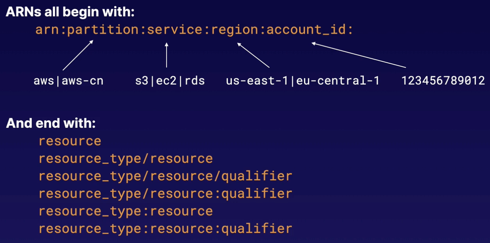

# AWS Identity and Access Management (IAM)

## Overview

IAM enables you to manage access to AWS services and resources securely.

IAM can be used to manage:
- Users.
- Groups.
- Access policies.
- Roles.
- User credentials.
- User password policies.
- Multi-factor authentication (MFA).
- API keys for programmatic access (CLI).

IAM is global and not specific to any one Region.

IAM is integrated with many AWS services by default.

No additional charge.

Identity Federation (including AD, Facebook etc). can be configured allowing secure access to AWS resources without creating an IAM user account.

## Root User

The root user is accessed by signing in with the email address and password that you used to create your AWS account.

The root user has complete access to all AWS services and resources in your account, as well as your billing and personal information.

Multi-factor authentication (MFA) can be enabled/enforced for the AWS root account and for individual users under the account.

Best Practices:
- Choose a strong password for the root user.
- [Enable MFA](https://docs.aws.amazon.com/IAM/latest/UserGuide/id_credentials_mfa_enable_virtual.html) on your root user
- Delete your root user's access keys in [My Security Credentials page](https://console.aws.amazon.com/iam/home?#security_credential)
- Do not use the root account for anything other than billing.
- Create an admin group for you administrators, and assign the appropriate permissions to this group. Create user accounts for administrators and add user to admin group.

## Amazon Resource Names

Amazon Resource Names (ARNs) are uniquely identify a resource within Amazon.

Example: `arn:aws:iam::123456789012:user/ryan`:
- partition: `aws`
- service: `iam`
- region: omitted, since IAM is a global service
- account number: `123456789012`
- resource type: `user`
- resource: `ryan`

## IAM User

An IAM user is an entity that represents a person or service.

Can be assigned:
- An access key ID and secret access key for programmatic access to the AWS API, CLI, SDK, and other development tools.
- A password for access to the management console.

By default users cannot access anything in your account. To allow the IAM user to perform specific actions in AWS, you must grant the IAM user the necessary permissions.

IAM users can be created to represent applications, and these are known as "service accounts".

Best practice: Create individual IAM users for each person who needs to access AWS. This provides additional security by allowing each IAM user to have a unique set of security credentials.

You can have up to 5000 users per AWS account.

## IAM Group

An IAM group is a collection of users.

All users in the group inherit the permissions assigned to the group.

A group is not an identity and cannot be identified as a principal in an IAM policy.

You cannot nest groups (groups within groups).

## IAM Role

An IAM role is a **temporary identity** that can be assumed by users or services to **delegate access**.

IAM users or AWS services can assume a role to obtain temporary security credentials that can be used to make AWS API calls. They must be granted permissions to switch to that role.

A role can be assigned to a federated user who signs in using an external identity provider.

Roles can enable cross-account access, allowing one AWS account to interact with resources in other AWS accounts.

Using roles is preferred for security reasons as it allows you to avoid hard-coding credentials.

IAM roles with EC2 instances:
- IAM roles can be used for granting applications running on EC2 instances permissions to AWS API requests using instance profiles.
- Only one role can be assigned to an EC2 instance at a time.
- When using the AWS CLI or API instance profiles must be created manually (it’s automatic and transparent through the console).
- Applications retrieve temporary security credentials from the instance metadata.

Role Delegation:
- Create an IAM role with two policies:
  - Permissions policy – grants the user of the role the required permissions on a resource.
  - Trust policy – specifies the trusted accounts that are allowed to assume the role.
- Wildcards (*) cannot be specified as a principal.
- A permissions policy must also be attached to the user in the trusted account.

## Instance Profiles

An instance profile is a container for an IAM role that you can use to pass role information to an EC2 instance when the instance starts.

An instance profile can contain only one IAM role, although a role can be included in multiple instance profiles.

## IAM Federation

You can combine your existing user account with AWS.

For example, when you log on to your PC (usually using Microsoft Active Directory), you can use the same credentials to log in to AWS if you set up federation.

To do that, you use **Identity Federation**, which uses the SAML standard, Open ID Connect (OIDC), and OAuth 2.0