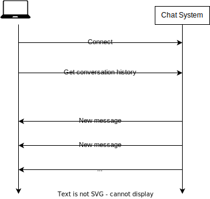
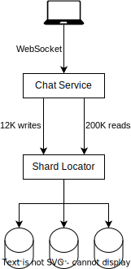

# Scaling Read

## Pushing new messages

With [basic design](./basic-design), the main bottle necks is all client constantly polling for new messages.

If we could just push new messages to client instead of polling, it could improve scalability greatly.

One of the most basic push mechanisms is WebSocket, that both support mobile and web client.

How it work?
1. Client connect to the system (only once)
2. Client requests conversation history to display the previous messages
3. The system can push new messages to client, no need for polling anymore

Although we have resolved polling issue from client, but the WebSocket handlers still produce the same load on database (200K selects per second) when fetching chat history.

## Read replicas

We'll try to use replicas to handle 200K concurently selects to database.

Let's say each database instance can handle 10K select per second. Then we'll need 20 replicas.

Cons:
- Eventually consistent. Updates may take several minutes to propagate to all replicas.
- Expensive. With 1 billion messages per day, the database will grow rapidly due to having 20 copies of the same database.

## Sharding

Choosing a shard key:
- `UserID`: to get all messages between two person, we need to query two shards, then filter out unrelevant messages
- Combine `from` and `to`: Messages from `A` to `B` and `B` to `A` end up in different shards
- Sort and combine `from` and `to`: Ensures messages between `A` and `B` are in the same shard. Using this approach, we can balance reads and writes across various shards.

We'll have a scalable Shard Locator Service that handle all reads and writes, directing them to the correct shard.

