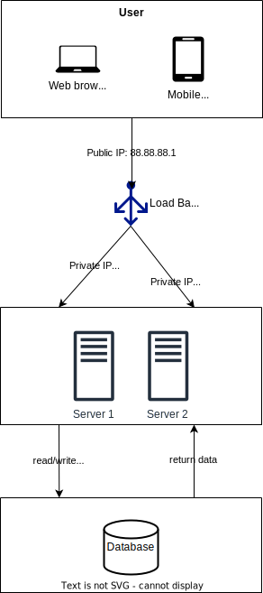
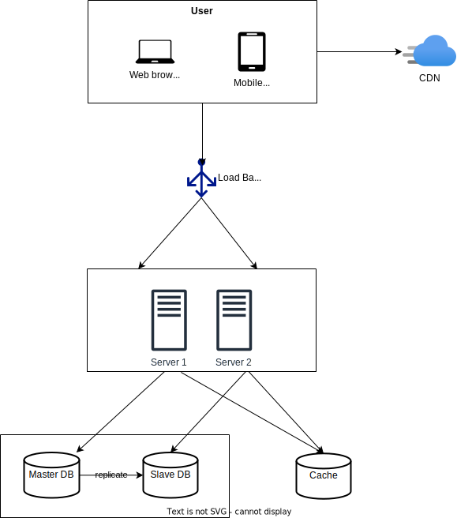

# Web application

Design a scalable and highly available web app that can serve millions of users.

## Single Server Setup

Start with a single server setup where everything is running on one server: web app, database, cache, etc.

The traffic to the server comes from two sources: web browser and mobile application:
- Web browser: sending HTTP requests (GET, POST, etc.) to the server. The server processing these requests and send back HTML content
- Mobile application: communicate with servers using APIs. JSON is a lightweight data format commonly used for API communication.

## Separated Database Server

With the growth of the user base, we need multiple servers: one for web/mobile traffic, the other for the database.

Separating web/mobile traffic (web tier) and database (data tier) servers allows them to be scaled independently.

## Scaling web tier

### Adding a load balancer

With the web app running on a single server:
- Users are connected to the web server directly. Users will unable to access the website if the web server is offline.
- If many users access the web server simultaneously and it reaches the web server’s load limit, users generally experience slower response or fail to connect to the server.

A load balancer is the best technique to address these problems.

After a load balancer and a second web server are added, we successfully solved no failover issue and improved the availability of the web tier:
- If server 1 goes offline, all the traffic will be routed to server 2. This prevents the website from going offline. We will also add a new healthy web server to the server pool to balance the load.
- If the website traffic grows rapidly, and two servers are not enough to handle the traffic, the load balancer can handle this problem gracefully. You only need to add more servers to the web server pool, and the load balancer automatically starts to send requests to them.

### Making the web tier stateless

We move the session data out of the web tier and store them in the persistent data store.

After the state data is removed out of web servers, auto-scaling of the web tier is easily achieved by adding or removing servers based on traffic load.

## High availability for database

The current design has one database run on one server, so it does not support failover and redundancy.

Database replication is a common technique to enhance read performance and fault tolerance.

## Improving server's response time

Here we improve performance of the web app by storing frequently accessed data in a cache layer, much faster then the database.

After receiving a request, a web server first checks if the cache has the available response. If it has, it sends data back to the client. If not, it queries the database, stores the response in cache, and sends it back to the client (read-through strategy).

## Improving asset's load time

Static assets (JS, CSS, images, etc.,) are no longer served by web servers. They are fetched from the CDN for better performance.

## Decoupling system's components

To further scale our system, we need to decouple different components of the system so they can be scaled independently.

Message queues are added to our design to make the system more loosely coupled and failure resilient.

## Set up logging & monitoring

Logging and monitoring are crucial for large sites:
- **Troubleshooting and Debugging**: Logs provide detailed records of events and errors, making it easier to identify and resolve issues.
- **Performance Monitoring**: Metrics help track the performance of various components of a site. They provide quantitative data, such as response times, error rates, and resource usage, which are essential for maintaining optimal performance
- **Observability**: Together, logs and metrics contribute to the overall observability of a system. Collecting different types of metrics help us to gain business insights and understand the health status of the system.

Some useful metrics:
- Host level metrics: CPU, Memory, disk I/O, etc.
- Aggregated level metrics: for example, the performance of the entire database tier, cache tier, etc.
- Key business metrics: daily active users, retention, revenue, etc.

## Scaling database

As the data grows every day, the database need to be scaled to maintains its performance and responsiveness as demand grows.

## Multiple data centers

To improve availability and provide a better user experience across wider geographical areas, supporting multiple data centers is crucial.

We set up two data centers. Users are routed to to the closest data center. This can be done using a DNS service that allows domain names to be resolved to IP addresses based on the location of a user.

