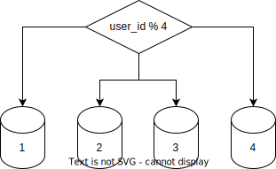

# Sharding

## Overview

Database sharding is a technique used to improve the performance and scalability of databases by splitting a large database into smaller, more manageable pieces called shards.

Each shard shares the same schema and is stored on a different server, allowing for parallel processing and reducing the load on any single server.

Sharding allows for horizontal scaling.

Data is distributed across multiple shards based on a sharding key, such as user ID or a hash function.

## Benefits

- Reduces the amount of data each server needs to process, leading to faster query response time
- Improved fault tolerance and reduced risk of total service outages

## Challenges

- Implementing and managing a sharded database can be complex
- Cross shard operations are expensive (e.g., joining)
- Ensuring data consistency across shards can be challenging
- Choosing a sharding strategy requires careful planning

## Sharding strategies

### Geo-Based Sharding

Data is sharded based on geographical location, which can help reduce latency and comply with data residency regulations.

**Pros**:
- Reduces latency for geographically distributed users
- Helps with compliance
- Easy to add new shards

**Cons**:
- Uneven distribution - some shards may be too big to handle
- Is not approrpiate to some systems 

**Example**:

Imagine an e-commerce platform that serves customers worldwide. The platform uses the `country_code` as the sharding key.

This ensures that data related to users from the same country is stored in the same shard:
- **User Data**: When a user from the United States registers, their data is stored in the North America shard. Similarly, a user from Germany will have their data stored in the Europe shard.
- **Order Data**: Orders placed by users are stored in the same shard as the user's data to maintain locality and reduce cross-region data access.

When a user from Japan logs in, the application routes the request to the Asia-Pacific shard. This shard handles all operations related to the user's data, such as retrieving order history or updating profile information.

### Hash-Based Sharding
A hash function is applied to a sharding key (e.g., user ID) to determine the shard where the data should be stored. This ensures a more even distribution of data.

**Pros**:
- Provides a balanced distribution of data across shards
- Works well for key-value data

**Cons**:
- Adding new shards is difficult due to changing hash function require re-deploying the application
- Not a good solution if database grows quickly
- Weak consistency (no foreign keys)
- Can make range queries more complex and less efficient

**Example**:

Let's consider an example where we have a user database with millions of users. We can shard the database based on the user ID to distribute the load across multiple servers.

Anytime you access data, a hash function is used to find the corresponding shard.

In our example, `user_id % 4` is used as the hash function. If the result equals to `0`, **shard 0** is used to store and fetch data. If the result equals to `1`, **shard 1** is used. The same logic applies to other shards.

### Range-Based Sharding
Data is divided into shards based on a specific range of values.

For example, you might shard data based on date ranges or alphabetical ranges.

**Pros**:
- Simple to implement and understand.

**Cons**:
- Can lead to uneven data distribution if the data is not uniformly distributed.

### Directory-Based Sharding
A lookup table (directory) is used to map each piece of data to a specific shard. This allows for flexible and dynamic sharding.

**Pros**:
- Highly flexible and can adapt to changing data patterns.

**Cons**:
- The directory can become a single point of failure and may require additional maintenance.

### Composite Sharding
Combines multiple sharding strategies, such as range-based and hash-based sharding, to leverage the benefits of both.

**Pros**:
- Can handle complex and diverse data distribution requirements.

**Cons**:
- More complex to implement and manage.

## Sharding key

The most important factor to consider when implementing a sharding strategy is the choice of the sharding key (partition key).

Sharding key consists of one or more columns that determine how data is distributed.

When choosing a sharding key, one of the most important criteria is to choose a key that can evenly distributed data.

## Shard router

A shard router is a component in a sharded database. It acts as an intermediary between client applications and the sharded database, directing queries to the appropriate shard(s) based on the sharding key.

**Pros**:
- This helps simplify adding new shards, since we extract the logic of locating shards from the application to a separate service.

**Cons**:
- The shard router can become a single point of failure if not configured to be highly available.

## Celebrity problem (hotspot)

Hotspot occurs when a particular shard receives a disproportionately high amount of traffic compared to others.

This can lead to performance bottlenecks and uneven load distribution.

*Imagine a social media platform where data for Katy Perry, Justin Bieber, and Lady Gaga all end up on the same shard. That shard will be overwhelmed with read operations. To solve this problem, we may need to allocate a shard for each celebrity. Each shard might even require further partition.*

## De-normalization

Once a database has been sharded across multiple servers, it is hard to perform join operations across database shards.

A common workaround is to de-normalize the database so that queries can be performed in a single table.

## Resharding data

Resharding data is needed when a single shard could no longer hold more data due to rapid growth.

Certain shards might experience shard exhaustion faster than others due to uneven data distribution.

When shard exhaustion happens, it requires updating the sharding function and moving data around.

[Consistent hashing](../consistent-hashing.md) is a commonly used technique to solve this problem.
