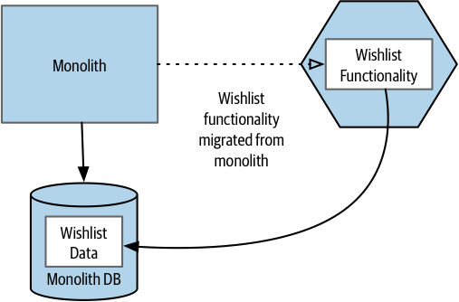

# Splitting the Monolith

## Have a Goal

Microservices are not the goal. You don't "win" by having microservices.

When embarking on work to migrate functionality from a monolithic architecture to a microservice architecture, you must have a clear understanding of what you expect to achieve. This goal will shape how you go about the work and will also help you understand whether you're moving in the right direction.

Don't be obsessed with creating microservices without ever asking why.

> Without a clear understanding as to what you are trying to achieve, you could fall into the trap of confusing activity with outcome. This is problematic in the extreme given the new sources of complexity that microservices can introduce.

## Incremental Migration

Migration should be incremental. Make a change, roll that change out, assess it, and go again. Even the act of splitting out one microservice can itself be broken down into a series of small steps.

> If you think microservices are a good idea, start somewhere small. Choose one or two areas of functionality, implement them as microservices, get them deployed into production, and then reflect on whether creating your new microservices helped you get closer to your end goal.

## The Dangers of Premature Decomposition

There is danger in creating microservices when you have an unclear understanding of the domain.

Prematurely decomposing a system into microservices can be costly, especially if you are new to the domain.

In many ways, having an existing codebase you want to decompose into microservices is much easier than trying to go to microservices from the beginning for this very reason.

## What to Split First?

Once you have a firm grasp on why you think microservices are a good idea, you can use this understanding to help prioritize which microservices to create first.

**Want to scale the application?**

Functionality that currently constrains the system's ability to handle load is going to be high on the list.

**Want to improve time to market?**

Look at the system's volatility to identify those pieces of functionality that change most frequently, and see if they would work as microservices.

> You can use static analysis tools like [CodeScene](https://www.codescene.com/) to quickly find volatile parts of your codebase.

The decision about which functionality to split into a microservice will end up being a balance between these two forces: **how easy the extraction is** versus **the benefit of extracting** the microservice in the first place.

It's advised to pick "easy things" first.

## Decomposition by Layer

After you've identified your the first microservice to extract, we can break that decomposition down into further, smaller steps.

In traditional three tiers of a web-based services stack, we can look at the functionality we want to extract in terms of its user interface, backend application code, and data.

### Decomposing UI

- Extracting user interface functionality related to the microservice could be considered a separate step.
- Ignoring the user interface part of the equation can lead to an overly siloed approach to any architectural restructuring.
- Sometimes the biggest benefits can come from decomposition of the UI, so ignoring it can be perilous.
- Decomposition of the UI tends to lag behind decomposition of the backend into microservices.
- Until the microservices are available, it's difficult to see the possibilities for UI decomposition; just make sure it doesn't lag too much.

### Extracting code first

- The code associated with the functionality is extracted into microservice. However, the data remains in the monolithic database.
- Extracting application code before data tends to deliver more short-term benefit and it's easier.
- If it is impossible to extract the application code cleanly, we could abort any further work, avoiding the need to detangle the database.
- However, if the application code is cleanly extracted but extracting data proves to be impossible, we could be in trouble. Therefore, it's essential to have looked at the associated data storage and have some idea as to whether extraction is viable and how you will go about it.

### Extracting data first

The data being extracted first, before the application code.

It can be useful in situations in which you are unsure whether the data can be separated cleanly. You prove that this can be done before moving on to the hopefully easier application code extraction.

The main benefit of this approach is in derisking the full extraction of the microservice. It forces you to deal up front with issues like loss of enforced data integrity in your database or lack of transactional operations across both sets of data.
