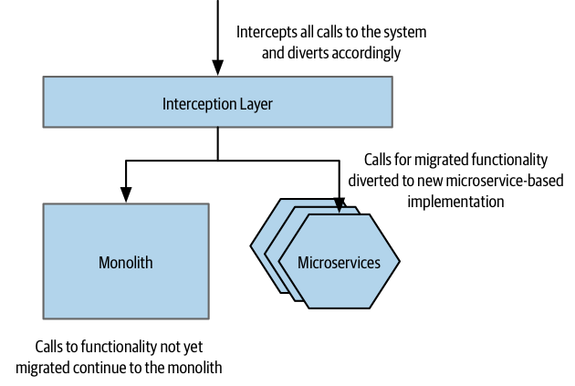

# Useful Decompositional Patterns

## Strangler Fig Pattern

The approach is wrapping an old system with the new system over time, allowing the new system to take over more and more features of the old system incrementally.

You intercept calls to the existing monolithic application, 
- If the call to that piece of functionality is implemented in our new microservice architecture, it is redirected to the microservice.
- If the functionality is still provided by the monolith, the call is allowed to continue to the monolith itself.

The beauty of this pattern is that it can often be done without making any changes to the underlying monolithic application. The monolith is unaware that it has even been "wrapped" with a newer system.

## Parallel Run

Running both your monolithic implementation of the functionality and the new microservice implementation side by side, serving the same requests, and comparing the results.

It helps to make sure the new functionality is working well without risking the existing system behavior of a tried and tested application.

## Feature Toggle

It is a mechanism that allows a feature to be switched off or on, or to switch between two different implementations of some functionality.

With the strangler fig pattern that use an HTTP proxy, we could implement the feature toggle in the proxy layer to allow for a simple control to switch between implementations of the functionality in the monolith and that in the new microservice.
