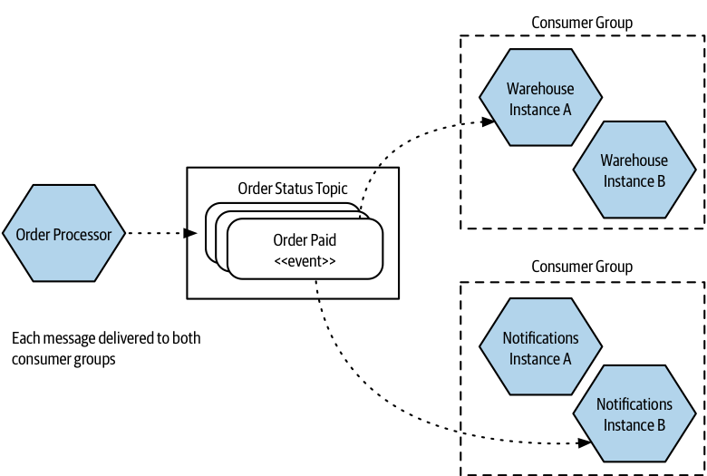

# Message Brokers

Message brokers are intermediaries, often called middleware, that sit between processes to manage communication between them. They are a popular choice to help implement asynchronous communication between microservices.

A message is a generic concept that defines the thing that a message broker sends. A message could contain a request, a response, or an event.

Rather than one microservice directly communicating with another microservice, the microservice instead gives a message to a message broker, with information about how the message should be sent.

## Topics and queues

**Queues** are typically point to point. A sender puts a message on a queue, and a consumer reads from that queue.

With a topic-based system, multiple consumers are able to subscribe to a **topic**, and each subscribed consumer will receive a copy of that message.

A **consumer** could represent one or more microservices—typically modeled as a consumer group. You can have multiple instances of a microservice, and you want any one of them to be able to receive a message.

When a message is put into the **queue**, only one member of the consumer group will receive that message; this means the queue works as a load distribution mechanism.

With **topics**, you can have multiple consumer groups. When an event is put onto a topic. A copy of that event is received by all consumer groups. Only one instance of each consumer group will see that event.

A large part of the **distinction** between the two is that when a message is sent over a queue, there is information of what the message is being sent to. With a topic, the sender is unaware of who will end up receiving the message.

Topics are a good fit for event-based collaboration, whereas queues would be more appropriate for request/response communication.

## Guaranteed delivery

Brokers provide some capabilities that can be very useful for asynchronous communication. The most interesting feature is that of guaranteed delivery.

**Guaranteed delivery** describes a commitment by the broker to ensure that the message is delivered.

> It's not a problem if the downstream destination is unavailable—the broker will hold on to the message until it can be delivered.
> 
> Compare that to a synchronous direct call—for example, an HTTP request: if the downstream destination isn't reachable, the upstream microservice will need to work out what to do with the request; should it retry the call or give up?

## Other characteristics

Most brokers can guarantee the **order** in which messages will be delivered.

Some brokers provide **transactions on write**. For instance, Kafka allows you to write to multiple topics in a single transaction.

Some brokers can also provide **read transactionality**. This can be useful if you want to ensure the message can be processed by the consumer before removing it from the broker.

Some brokers promise exactly **once delivery**, no mesages are resent. It's better to build your consumers in such a way that they are prepared for the fact that they might receive a message more than once and can handle this situation.

> A very simple example would be for each message to have an ID, which a consumer can check each time a message is received. If a message with that ID has already been processed, the newer message can be ignored.

## Choices

Popular examples include RabbitMQ, ActiveMQ, and Kafka.

Cloud vendors provide fully managed brokers. For example., AWS, has Simple Queue Service (SQS), Simple Notification Service (SNS), and Kinesis, all of which provide different flavors of fully.

### Kafka

Kafka is a specific broker that has gained popularity, particularly due to its role in facilitating the movement of large volumes of data for stream processing pipelines, transitioning from batch-oriented to real-time processing.

Kafka is designed for very large-scale use, having been created at LinkedIn to consolidate multiple message clusters into a single platform. It supports multiple consumers and producers, even at scales as high as fifty thousand producers and consumers within the same cluster.

A unique feature of Kafka is message permanence. Messages can be stored for a configurable period, allowing them to be retained indefinitely. This feature enables consumers to reprocess messages or new consumers to access previously sent messages.

Kafka also offers built-in support for stream processing, eliminating the need for a dedicated stream processing tool. Using KSQL, SQL-like statements can be defined to process one or more topics in real-time, creating dynamically updating materialized database views with Kafka topics as the data source. This capability introduces new possibilities for managing data in distributed systems.