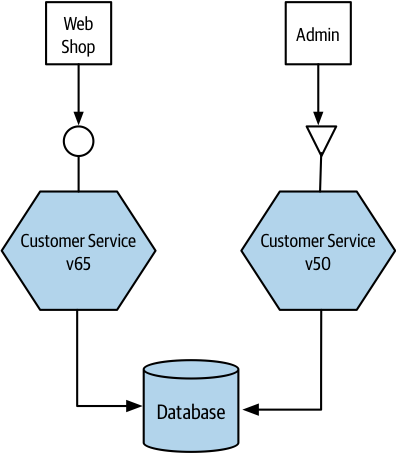
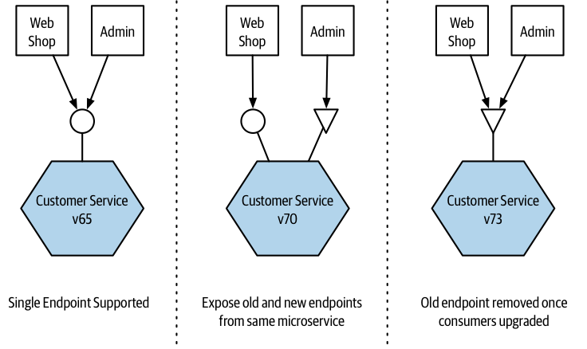

# Managing Breaking Changes

Three main options when have breaking changes:

## Lockstep deployment

Require that the microservice exposing the interface and all consumers of that interface are changed at the same time.

Lockstep deployment conflict with independent deployability in microservices.

If we want to be able to deploy a new version of our microservice with a breaking change to its interface but still do this in an independent fashion, we need to give our consumers time to upgrade to the new interface.

## Coexist incompatible microservice versions

Run old and new versions of the microservice side by side.

Older consumers continue to use the older version, while newer consumers access the new one.

> This is the approach used sparingly by Netflix in situations in which the cost of changing older consumers is too high, especially in rare cases in which legacy devices are still tied to older versions of the API.

**Challenges:**
- addressing an internal bug in the service requires fixing and **deploying** two separate sets of services, potentially leading to codebase branching issues.
- it necessitates complex logic to **route** consumers to the appropriate microservice, often implemented in middleware or nginx scripts, making system behavior harder to understand.
- handling persistent state, such as customer data, created by different service versions adds complexity since this **data** must be accessible to all services, regardless of the version that initially created it.

**When to use it:**

Coexisting concurrent service versions for a brief period is sensible, especially in canary releases. In these cases, both versions may overlap for just a few minutes or hours, typically involving only two service versions at once.

If the transition of consumers to the new version and its release takes longer, it's more practical to coexist different endpoints within the same microservice, rather than maintaining entirely separate versions.

## Emulate the old interface (recommended)

Have your microservice expose the new interface and also emulate the old interface.

When releasing a breaking change, a new version of the service is deployed, exposing both the old and new versions of the endpoint.

This allows us to get the new microservice out as soon as possible, along with the new interface, while giving time for consumers to move over. Once all the consumers are no longer using the old endpoint, you can remove it along with any associated code.

This is in effect an example of the **expand and contract pattern**, which allows us to phase in breaking changes. We expand the capabilities we offer, supporting both old and new ways of doing something. Once the old consumers do things in the new way, we contract our API, removing the old functionality.

For systems making use of **HTTP**, choose between version numbers in URI (for example, `/v1/customer` or `.v2/customer`) or request headers (opaque) for routing, based on your project's needs and client behavior preferences.

For **RPC**, methods are put in different namespaces (for example, `v1.createCustomer` and `v2.createCustomer`). When you are trying to support different versions of the same types being sent over the network, this approach can become really painful.

## Which approach is recommended?

**Lockstep release** can be considered in situations where the same team manages both the microservice and its consumers, but it should be used cautiously to avoid losing independent deployability.

Overusing lockstep deployments can lead to a distributed monolith, so it should be used sparingly.

**Coexisting different versions** of the same microservice can be problematic, especially if consumers need time to upgrade.
Coexistence of microservice versions may be suitable for **short-term scenarios**, such as blue-green deployments or canary releases, where the downsides are offset by shorter durations.

The preferred approach is to use **emulation of old endpoints** whenever possible, as the challenges of implementing emulation are generally easier to deal with than coexisting microservice versions.

## The social contract

Backward-incompatible changes are often driven by consumer requests or can benefit them, but discussions and agreements are essential to manage the transition effectively.

Both the owner and the consumer of a microservice need to be clear on a few things:

- How will you raise the issue that the interface needs to change?
- How will the consumers and microservice teams collaborate to agree on what the change will look like?
- Who is expected to do the work to update the consumers?
- When the change is agreed on, how long will consumers have to shift over to the new interface before it is removed?

One of the secrets to an effective microservice architecture is to embrace a consumer-first approach. The consumers' needs are paramount, and if you are making changes to a microservice that are going to cause upstream consumers problems, this needs to be taken into account.

## Tracking Usage

**Logging** is essential for each endpoint that a microservice exposes to track usage and identify consumers who are still using the old interface.

Having a **client identifier** is valuable for communication and coordination with teams that need to migrate away from the old interface.

The client identifier could be something as simple as asking consumers to put their identifer in the **user-agent header** when making HTTP requests, or you could require that all calls go via some sort of **API gateway** where clients need keys to identify themselves.

## Extreme Measures

In cases where consumers are still not upgrading even after agreeing to do so, extreme measures may be considered.

An example from a large tech company involved setting a generous **one-year period before retiring old interfaces**. The company did not track old interface usage but turned it off after one year. Responsibility for system failures due to the old interface being turned off was shifted to the consuming microservice's team, which had a year to make the transition. This extreme approach may not work for many and can lead to inefficiency, as it doesn't consider tracking to identify active users.

Another extreme measure involves intentionally **slowing down the responses of the old library** to encourage teams to upgrade to a newer, better one. The duration of the slowdown was gradually increased to send a message.

Extreme measures like these should only be considered after exhausting reasonable efforts to encourage consumers to upgrade.