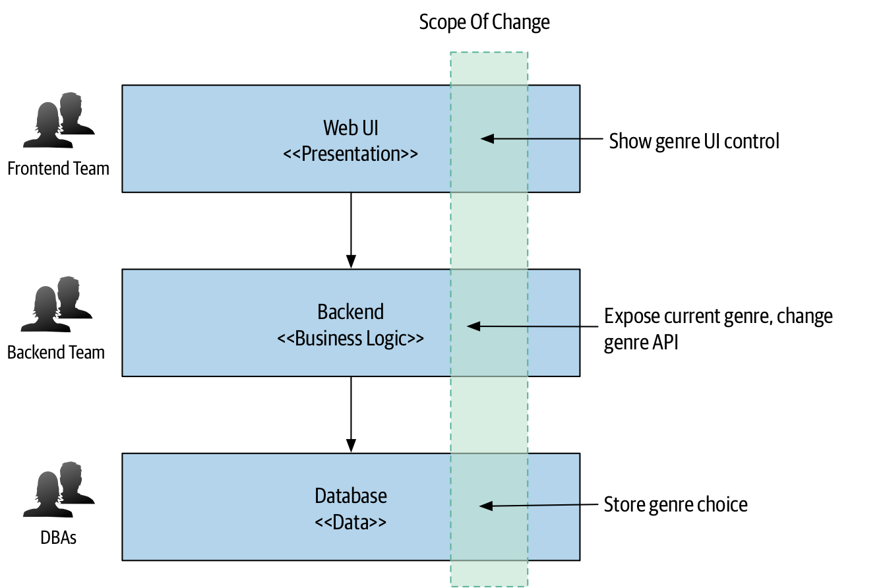
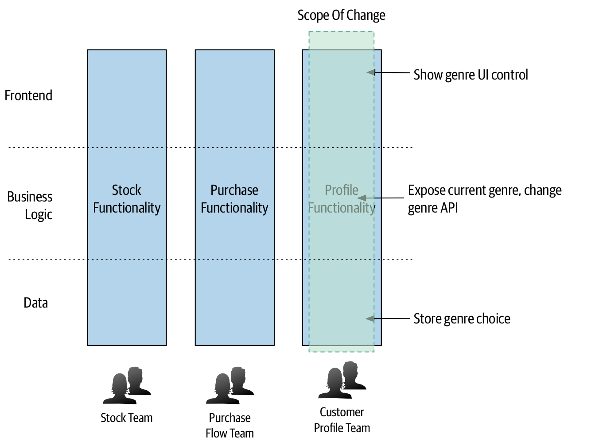

# What are Microservices

This document is a shorten version of the book "**Building Microservices, 2nd Edition**".

## Microservices at a Glance

1. Microservices are **independently releasable services** that are modeled around a business domain (a **service** here typically means a completely separate operating system process).
6. **Independent deployability** is a key aspect of microservices. Deploying and releasing changes to a single microservice into production without having to deploy anything else.
2. A microservice encapsulates functionality and makes it accessible to other services **via networks**.
9. Microservices host business functionality on one or more network endpoints.
10. Consumers access microservice functionality through networked endpoints.
3. Microservices can be combined to create a more complex system.
5. Microservices are a type of service-oriented architecture (SOA). They are opinionated about how service boundaries should be drawn.
7. Microservices are **technology agnostic**, offering advantages in flexibility.
8. From the outside, a single microservice is treated as a **black box**. Internal implementation details are hidden from the outside.
12. Microservice architectures **avoid the use of shared databases** in most circumstances.
13. Each microservice encapsulates its own database where required.

## Service-oriented architectur vs Microservices

- Service-oriented architecture (SOA) is a design approach where multiple services collaborate to provide a set of capabilities.
- SOA aims to promote software reusability and easier maintenance or rewriting of software.
- Lack of consensus on how to do SOA well has been an issue in the industry.
- Microservices have emerged as a specific approach for doing SOA well.
- Microservices can be seen as a specific approach for SOA, similar to how Extreme Programming (XP) or Scrum is a specific approach for Agile software development.

## Key Concepts of Microservices

### Independent Deployability

- Independent deployability means making changes to a microservice and releasing those changes without having to deploy other microservices.
- Loosely coupled microservices are essential for achieving independent deployability.
- Well-defined and stable contracts between services are necessary for loose coupling.
- Sharing databases can make achieving independent deployability difficult.
- Independent deployability has many benefits and can lead to ancillary benefits.
- The focus on independent deployability guides the identification of microservice boundaries.

### Modeled Around a Business Domain

- **Domain-driven design** can be used to structure code to better represent the real-world domain.
- Microservice architectures use the same idea of **modeling services around business domains** to facilitate easier rollout of new functionality and recombination of microservices.
- Cross-service changes should be minimized and kept infrequent. Making changes that require modifications to multiple microservices is expensive and requires coordination across services and potentially different teams.
- In **Layered architectures**, such as three-tiered architectures, often lead to changes spanning multiple layers (presentation, application, data) and become even more complex with additional layers.
- By making services end-to-end slices of business functionality, we prioritize high **cohesion of business functionality** over technical functionality.

### Owning Their Own State

- Microservices should **avoid using shared databases** and instead access data from other microservices when needed.
- Sharing databases is one of the worst things you can do if you’re trying to achieve independent deployability.
- This allows microservices to have control over what data is shared and what is hidden, separating internal implementation from external contract.
- Hiding internal state in a microservice is similar to encapsulation in object-oriented programming, where data is hidden and only accessed through defined interfaces.
- Services should be seen as end-to-end slices of business functionality, encapsulating UI, business logic, and data.

### Size

- The concept of size is not the most important aspect when considering microservices as an architecture.
- It is more important to focus on how many microservices can be effectively managed and how to define boundaries to avoid coupling.
- A microservice should be kept at a size that can be easily understood, based on individual abilities.
- "Size" in microservices can be seen as having a small interface for information hiding.
- Size is highly contextual and subjective based on experience and company norms.

### Flexibility

- Microservices provide flexibility and options for organizations in terms of organizational, technical, scale, and robustness aspects.
- Adopting microservices is a decision that requires weighing the cost versus the desired options.
- Balancing the openness of options with the associated costs is an art.
- Incremental adoption of microservices is recommended to gradually assess the impact and make adjustments as needed.

### Alignment of Architecture and Organization

- The common use of three-tiered architecture is due to its familiarity and the way teams are traditionally organized based on core competencies
- However, there is a shift towards organizing teams in terms of breaking systems apart and reducing handoffs and silos

- A potential alternative architecture is to organize the organization and architecture along vertical business lines, with dedicated teams responsible for specific aspects of functionality
- In this case, a microservice owned by the profile team would handle the customer profile functionality, including the ability to update information and store customer state
- The choice of a favorite genre would be associated with a given customer, making the change more localized

- Other microservices, such as a Catalog microservice and a Recommendation microservice, can also interact with the customer microservice
- This architecture aligns teams to lines of business within the organization and makes it easier to make changes

